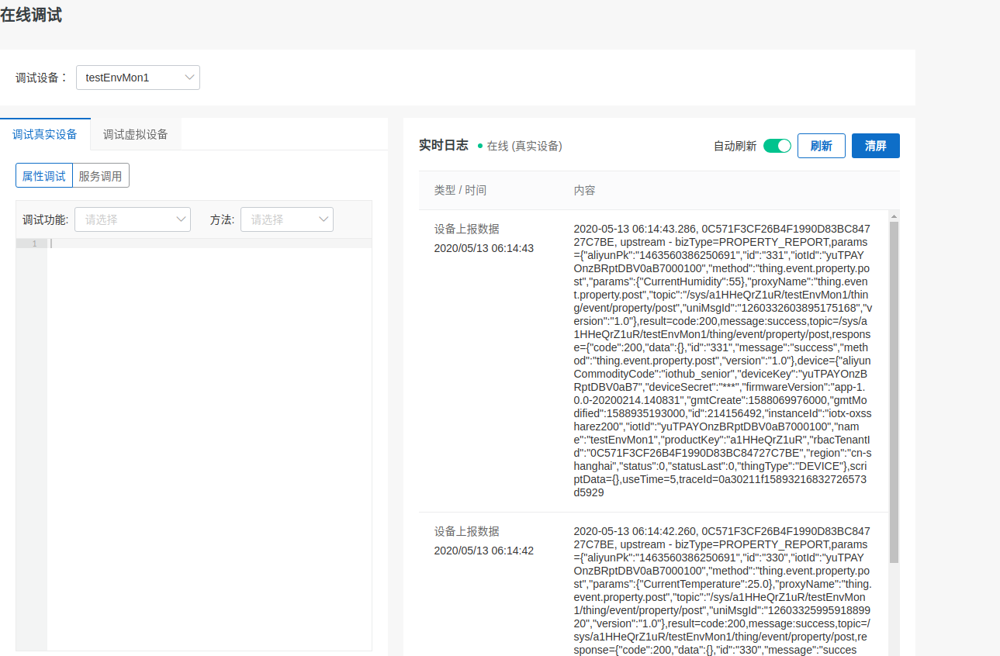

---

# 概述
物联网系统，顾名思义，物的联网。传统网络终端主要是手机电脑这样面向人的设备，人是网络的主要用户。具备Wifi等联网能力的芯片长期以来在成本上无法满足开关这样的简单家用控制要求，直到2014年乐鑫发布esp8266芯片。它和类似的竞品器件迅速使得诸如灯/插座这样海量低价单品，可以通过互联网访问和控制。物联网正在迅速地渗入我们的日常生活。

类似于QQ钉钉等面向人的网络应用，物联网系统也需要一个相对集中的云端服务，用来给予每台物联网设备一个网络帐号，管理设备、所有者、应用系统之间的关联。在这个层面上，我们可以把物联网系统理解成一个让物品能够登录在线的即时通信系统，在这个系统中，物与物，物与人，物与应用系统之间近乎实时地交换信息，在互联网所及的范围之内，实现对物和过程的智能化感知、控制和管理。

物联网系统所依托的网络就是我们身边的互联网，相对传统网络应用，构建物联网系统的主要任务是设计实现设备端和云端服务。物联网设备端必须能够以远低于手机/电脑等网络终端的价格实现网络接入，否则无法达成足够广泛的场合覆盖。相对于手机/计算机的硬件平台标准化通用化程度，物联网设备的硬件更加多样化，资源紧凑，软件形态一般是嵌入式软件，开发难度相对较高。

这几年来，阿里、华为、腾讯等大厂都在物联网领域发力，构建了自己的物联网云平台，提供了设备端软件基础构架。

FUMIOT基于阿里的Alios Things开源嵌入式操作系统，完成了乐鑫ESP8266、ESP32，庆科EMW3060等不同硬件接入阿里云物联网平台的开发。为了促进物联网技术的应用和交流，我们将在下面讲解如何使用Alios Things+乐鑫WiFi Soc搭建物联网设备，接入阿里云物联网平台，实现物联网灯/插座和环境监测器，以及相关的手机APP和网页控制面板。[硬件设计CAD图和软件源代码](https://github.com/fumiot/bb1)均以在github开源，欢迎读者下载、反馈和参与改进。

# 目标与范围
建立一个整体可运行的物联网应用系统。包括实际的物联网设备硬件，物联网云平台服务，web应用，手机APP这几个部分的建立和互通。每个方面在这里都不会深入讨论其原理，基于廉价（总价40元左右）易得的通用硬件模块，给出读者在1天时间内即可完成搭建和配置过程。

我们用一个具体的硬件平台，提供可直接烧录运行的固件，目的是在这么一个可运行的完整系统上，提供物联网系统的整体观，提供具体方面深入研究的代码级入口和系统级验证环境。为物联网应用开发提供一个系统级完整可运行的起点，基于这个起点，面向具体产品需要，可在各个方面深入。

Alios things官方文档全面，难以同时兼顾具体案例的完整性与浅显性。本文描述的范例，可以作为深入学习理解Alios things和物联网系统的入门。

# 预期读者
技术基础

高中以上即可按步骤搭建跑通。
可供物联网应用系统的产品经理，项目总体，嵌入式开发者，云端web应用开发者，手机APP开发者作为参考。
对于面向具体方面深入理解和定制需求，需要一下的技术基础：
设备端：单片机、C语言相关技术;
应用服务端：基于Java或Python的Web服务开发技术;
手机APP：Android（Java）、iOS（Objective-C）手机App开发。

# 免责声明

本文提供的内容、源代码是“原样”提供的，FUMIOT不对其使用或性能作出任何保证。其中包括任何明示的或默示的适销性、特别用途适用性或无知识产权侵权保证。FUMIOT不保证使用本文和相关软件所获的性能和结果。FUMIOT及其供应商不就任何事项做出保证、条件、陈述或条款（不论是明示的或默示的，无论是依据条例、普通法、惯例、常例，还是其他任何原因）包括但不限于不侵犯任何一方权利、适销性、完整性、满意的质量或适用于任何特殊用途。

# 版权

本文的版权协议为 [CC-BY-NC-ND license](https://creativecommons.org/licenses/by-nc-nd/3.0/deed.zh)。

# 所需资源
## 硬件
物联网设备需要一个具备无线通信能力控制板，我们的控制板基于通用的ESP32核心板以面包板构建。对传感器等外设没有依赖的功能及demo可以直接在核心板上直接运行。

硬件设计目标是利用廉价易得的通用模块，构建便宜的硬件即可运行本书所构建的物联网应用系统例程。例程所用的硬件称为fumiot_bb1，原理图(链接)。fumiot_bb1能够用面包板轻松搭建，具备一个连接LED的GPIO输出，一个按键输入，可自选的温湿度传感器、加速度传感器、气压传感器等等。使用的NodeMCU-32S，自带一个接在GPIO0上的按键输入，一个接在GPIO2上的LED输出。
## 软件
本文用到的软件在github/fumiot。嵌入式软件基于alios-things构建，针对fumiot_bb1硬件进行了定制和修订。github/fumiot/Alios-Things直接可用。代码及本书均在github/fumiot/bb1.
Alios-thing迭代迅速，fumiot的目标之一是保持与其同步更新。截至2020年4月，bb1硬件支持的alios-things版本为v3.1.0。检查github/fumiot/bb1获取最新版本。
## 物联网云平台
aliyun，可免费部署50个测试节点。
正式产品接入费用可在物联网控制台中查看。
# 硬件搭建
当前的硬件配置：
|名称|价格|
|------|------|
|ESP32S核心板|20|
|SHT30温湿度传感器模块|13|
|杜邦线4股|1|
|总计|34|
可以加一个SSD1306的OLED做设备端显示，效果会更好一点。

无需工具，手工插接四根杜邦线即可。

面包板连线图片。

连好的面包板。

# 建立开发环境
开发环境的建立，有原生Linux系统最好，装Ubuntu 16.04就行了。Windows平台用docker下载安装好的镜像。
详细步骤

[Linux环境安装](https://help.aliyun.com/document_detail/161037.html?spm=a2c4g.11186623.4.1.10eb1c1eAt2rkl)

[Window环境安装](https://help.aliyun.com/document_detail/161038.html?spm=a2c4g.11186623.4.1.355e37e20nAwoy)

根据自己用的系统，选一种就行了，最后都是得到一个Linux环境，虚拟机或者物理实机，殊途同归。

安装步骤中，**编译**这一步面向庆科的mk3060创建了实例并编译，如果手头有
庆科mk3060开发板，可以按照庆科开发板的下载程序步骤，把helloworld烧写到板子里面，用串口工具查看输出的hello world。

Jlink仿真器步骤可选，需要打断点单步调试要用到相关设置。

## 本机编译验证
验证：hello world@linuxhost
## 面向esp32核心板编译、烧写验证：
hello world@esp32devkitc


# 注册云端资源
去阿里云的[生活物联网平台](https://living.aliyun.com/home)，点击开放平台入口，登录或者免费注册帐号。可以使用淘宝帐号，实名认证后就能开通物联网服务，创建项目和产品，在这里创建的产品，可以用的手机公版云智能app控制。
如下图：


点击 “开放平台入口”，在下图中，注册阿里云帐号，也可使用淘宝帐号登录。


获取物联网平台授权


生活物联网平台有一个项目-产品-设备的层次结构，一个项目包括若干种产品，每种产品下可以创建若干具体设备的帐号。每个设备的在云平台上由*设备名称*，*设备密钥*，*产品名称*这个字符串唯一地标识，称为三元组，三元组加上*产品密钥*称为四元组。设备在登录云平台时要使用四元组，类似于人登录网络时的使用用户名和密码。
我们先点击“创建项目” 创建一个项目，后面的产品以及设备会在这个项目中创建。


# WiFi智能插座
## 设备端
智能插座是典型的物联网应用，目前相关产品已经比较成熟，市场上的智能插座智能灯都是这类产品。我们会控制核心板上的LED，要实现对强电的控制，把LED对应的GPIO2接到继电器等驱动电路即可。
打开项目，创建产品，产品类目选择 “电工照明”-"插座"


点击完成，确认功能定义如下图所示，有“电源开关”，“故障上报”这两个必选项。


点击下一步，系统提示我们选择所用的模块，这里选ESP32-WROOM-32DC。这个选择实际上与具体实现所用的硬件没有直接绑定关系。选好模块后，出现了*设备调试*页面，在这里我们点击*新增测试设备*，调试阶段建议输入一个人易读的设备名称，不要让系统自动生成。创建设备的四元组，我们下面会直接用在源代码里面。当然，大量批产的实际产品不应把四元组写在源代码里面，应该是在生产阶段用某种方式写入每个设备。


到了这一步，我们就获得了连接阿里物联网云平台所需的四元组。

## 设备到云的连接
在源代码中，填入所获得的四元组
linkkit_example_solo.c的中，找到如下的四行处，将这四行的内容，分别换成上面新增设备获得的四元组的值：
```
#define PRODUCT_KEY      "a1FxISeKbq9"
#define PRODUCT_SECRET   "ThNbP5iNUQ1lQe2Q"
#define DEVICE_NAME      "alen-activate-test"
#define DEVICE_SECRET    "jcumDL5AJRgU7zRNcCcnHRiQmtii0vDn"
```

编译：

```
$ aos make
```
用手机数据线连接esp32，烧录固件：
```
aos upload
```
有些电脑需要手工按着板子上的IO0按键才能顺利进入烧录模式完成烧录。
用minicom打开一个串口终端，串口设置为115200 8N1，可以看见板子串口上输出的Log信息。

我们先使用串口控制台配网，连接 Wifi。
在minicom中，敲键盘回车，可以看见命令提示符#
输入命令：
netmgr connect WiFi热点名称 Wifi密码
输入回显可能会被输出的LOG信息打断，不用管它，正确地输入上面的命令，Enter，板子应能连接到Wifi热点，然后自动连接阿里云平台。minicom中能够看到这一过程输出的Log信息。
进入[物联网云平台](https://living.aliyun.com/home)，再次打开*设备调试*页，可以
看到设备在线，点击查看和调试可以看到设备更详细的云端状态信息和调试信息。按板子上的IO0按钮，可见板上灯切换亮灭状态，设备云端状态信息或者调试信息会同步更新。


至此，我们就完成了设备端的工作。

## Wifi配网
<span id="Wifi配网"></span>
多数物联网产品没有键盘和屏幕，如何把Wifi密码输入到设备是个问题，这就是WiFi配网。上例中，我们通过设备的调试串口，用电脑连线给设备输入了Wifi热点名称和密码，完成了Wifi配网，实际产品是不可能这样做的。下面为设备配置一键配网，使得用户可以通过手机扫二维码，在设备上按一下按键，给新设备Wifi配网。

进入[物联网云平台](https://living.aliyun.com/home)，再次打开*设备调试*页，点击*下一步：人机交互*


我们至少要完成*面板选择*、*分享方式*、*多语言管理*、*配网引导*这四项的设置。

点击*未设置*按钮，打开对应设置页面。在预定义面板中，选择一种合适的样式。

分享方式我们选定授权式，多语言管理中，在中文页面中填写品牌名称，产品名称，产品型号。

配网引导我们启用一键配网，关闭其他方式。


编辑引导页面，可修改手机app上显示的提示信息。


人机交互方式设置完毕后，手机就可以扫码下载云智能APP，使用云智能APP扫码对设备进行配网了。

## 手机APP控制设备

扫码配网成功后，可以打开选定的设备面板，对设备的状态进行控制，手机APP操作时，可以看见板上GPIO所连接的LED相应地切换亮灭状态。设备按键改变LED状态时，也可以看到手机APP显示的状态同步变化。手机界面如下图所示：


# 天猫精灵语音控制

## 其他开关单品

其他开关单品，设备端功能几乎相同，一般只需改改物模型的JSON对象名称，配置手机APP控制面板就行了。


# 环境监测

## 概述

Alios-things包括了许多传感器的驱动，我们在这里把一个i2c接口的SHT30温度传感器模块，挂接在ESP32的i2c总线上。接线表：

|SHT30|ESP32模块|
|------|------|
|VCC|3V3|
|GND|GND|
|SDA|P18|
|SCL|P19|

## 云端定义产品和创建设备

打开项目，创建产品，产品类目选择 “家居安防”-"温湿度采集单元"


点击完成，添加*当前温度*和*当前湿度*这两个标准功能。


确认产品功能定义如下图所示：


点击下一步，选ESP32-WROOM-32DC模块。这个选择实际上与具体实现所用的硬件没有直接绑定关系。在*设备调试*页面，点击*新增测试设备*，获得测试设备的四元组。

## 设备到云的连接
在源代码中，填入所获得的四元组
linkkit_example_solo.c的中，找到如下的四行处，将这四行的内容，分别换成上面新增设备获得的四元组的值：
```
#define PRODUCT_KEY      "a1FxISeKbq9"
#define PRODUCT_SECRET   "ThNbP5iNUQ1lQe2Q"
#define DEVICE_NAME      "alen-activate-test"
#define DEVICE_SECRET    "jcumDL5AJRgU7zRNcCcnHRiQmtii0vDn"
```

编译：

```
$ aos make
```
用手机数据线连接esp32，烧录固件：

```
aos upload
```

有些电脑需要手工按着板子上的IO0按键才能顺利进入烧录模式完成烧录。
用minicom打开一个串口终端，串口设置为115200 8N1，可以看见板子串口上输出的Log信息。

我们先使用串口控制台配网，连接 Wifi。
在minicom中，敲键盘回车，可以看见命令提示符#
输入命令：
netmgr connect WiFi热点名称 Wifi密码
输入回显可能会被输出的LOG信息打断，不用管它，正确地输入上面的命令，Enter，板子应能连接到Wifi热点，然后自动连接阿里云平台。minicom中能够看到这一过程输出的Log信息。
进入[物联网云平台](https://living.aliyun.com/home)，再次打开*设备调试*页，可以
看到设备在线，点击查看和调试可以看到设备更详细的云端状态信息和调试信息。按板子上的IO0按钮，可见板上灯切换亮灭状态，设备云端状态信息或者调试信息会同步更新。



至此，我们就完成了设备端的工作。

## 公版云智能APP配网和访问

参照[智能插座Wifi配网](#Wifi配网)的步骤，可为设备配置启用公版云智能APP扫码配网和信息上显。
手机显示效果如下图所示：


