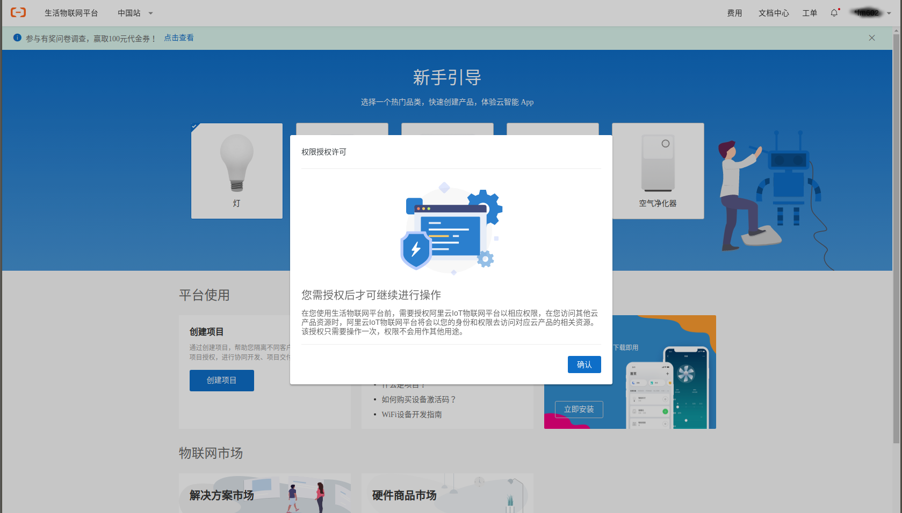

---

管窥物联网技术(Rev_2021Q2)

# 概述
物联网技术把灯、插座、冰箱空调等物品联入互联网，用户通过手机APP对它们联网控制，云端基于上报的大量数据能够对设备形成“智能”化的自动控制。2015年以来，强劲的市场需求推动物联网SoC器件和物联网云端服务飞速发展。联网的电器很容易提供一些“智能”的功能，比如灯的定时开关、场景联动等等，市场上常常把这些联网的“物”称为“智能”的。比如，智能灯、智能音箱、智能插座、智能冰箱等等。

直到2010年代早期，Arduino的Wifi模块还需要百元左右，比主控板还要贵。物联网产品稀少，云端平台功能单薄，不好卖也不好玩。2015年后，ESP8266等廉价Wifi芯片的推广伴随着物联网市场的井喷，为物联网技术带来更多关注，也为研究者和玩家提供了更多的机会。掌握物联网技术，意味着在一个蓬勃发展的行业拥有一席之地，学习把玩的同时可以搭建一些有意思的联网智能装置。又赚钱又好玩的东西，谁又不喜欢呢？

局域网里面的两个网络节点，如连到一个热点的手机和设备，能够直接使用各自的本机IP地址互通，无需第三方节点的辅助。相对比，物联网系统基于电信运营商提供的互联网，网络结构复杂，任意两个网络终端节点之间几乎无法建立直接的网络连接。QQ钉钉等网络应用程序都会需要用户先连接并登录到一个公共的服务器，通过这个服务器的中转协调，在终端用户之间建立通信。与之类似，物联网系统也需要一个相对集中的云端服务，用来给予每台物联网设备一个网络帐号，管理和维护物联网终端设备、所有者、应用系统之间的关联，以云端服务为纽带建立整个系统各种节点之间的互联互通。在这个层面上，我们可以把物联网系统理解成一个让物品能够登录在线的即时通信系统，在这个系统中，物与物，物与人，物与应用系统之间近乎实时地交换信息，在互联网所及的范围之内，实现对物和过程的智能化感知、控制和管理。

构建物联网系统需要我们设计开发设备端软硬件、云端服务和手机APP。满足消费品成本约束的物联网设备端，必须能够以远低于手机/电脑等网络终端的价格实现网络接入，否则无法达成足够广泛的场合覆盖。相对于手机/计算机的硬件平台标准化通用化程度，物联网设备的硬件平台更加多样化，资源更加紧凑，软件形态是嵌入式软件，开发难度相对较高。

这几年来，谷歌、亚马逊、微软、阿里、华为、腾讯等网络巨头都在物联网领域发力，构建了自己的物联网云平台，定义了物联网系统的一般架构和基础服务，提供了设备端软件SDK或者嵌入式OS，形成了物联网系统的共性基础设施。有些物联网云平台提供了比较低的接入门槛，开发者能够免费接入数十个物联网终端节点，足够学习研究，产品样机的开发调试使用。

# 本文的内容

本文基于FUMIOT&reg;在2021年对于物联网技术的研究工作，目标是讨论物联网技术的一般原理和应用。犹如讨论计算机技术不能避开Intel 8086和IBM PC，我们的讨论也会涉及具体的基础产品厂商，如在物联网SoC芯片市场影响力较大的乐鑫esp8266和esp32芯片。物联网云平台方面国内尚没有出现呈现明显优势的云服务商，不失一般性地我们选用了阿里云的服务。如此管窥难免有其局限性，但是我们依然会尽量对一般的技术予以阐述，这些一般的技术原理适用于基于其他的厂家的物联网基础产品构建物联网应用解决方案，如庆科、beken、csky等厂家的SoC芯片，亚马逊、百度云、腾讯云、微软Azure等厂家的物联网云平台服务。

本文结合可运行的智能灯/插座、环境温湿度监控两个物联网系统示例，讨论IoT系统架构、IoT开发环境、工具和调试技术、硬件接口技术、传感器应用、通信技术、RTOS、网络安全技术、测试验证、嵌入式开发技术、程序设计技术（构建之法，软件工程）等构建和维护物联网应用系统所需要的各种知识与技能。本文示例采用Alios Things+乐鑫WiFi Soc搭建物联网设备，接入阿里云物联网平台，支持云智能公版手机APP。[硬件设计CAD图和软件源代码](https://github.com/fumiot/bb1)均以在github开源，欢迎读者下载、反馈和参与改进。

# 预期读者
高中以上即可按步骤搭建跑通示例。读者需要基本的C语言能力，有一定的单片机和互联网前后端应用开发知识。
可供设计开发智能家电、工业物联网等物联网应用系统的产品经理、项目总体、嵌入式开发者、云端web应用开发者、手机APP开发者参考。
对于面向具体方面深入理解和定制需求，需要以下的具体技术基础：
设备端：单片机、C语言相关技术;
应用服务端：基于Java或Python的Web服务开发技术;
手机APP：Android（Java）、iOS（Objective-C）手机App开发。

# 免责声明

本文提供的内容、源代码是“原样”提供的，FUMIOT&reg;不对其使用或性能作出任何保证。其中包括任何明示的或默示的适销性、特别用途适用性或无知识产权侵权保证。FUMIOT&reg;不保证使用本文和相关软件所获的性能和结果。FUMIOT&reg;及其供应商不就任何事项做出保证、条件、陈述或条款（不论是明示的或默示的，无论是依据条例、普通法、惯例、常例，还是其他任何原因）包括但不限于不侵犯任何一方权利、适销性、完整性、满意的质量或适用于任何特殊用途。

# 版权

本文的版权协议为 [CC-BY-NC-ND license](https://creativecommons.org/licenses/by-nc-nd/3.0/deed.zh)。


# 1. IoT系统架构

IoT系统架构与传统的上位机+单片机构成的多机系统有相似之处。传统的多机系统一般由少量的通用计算机规模的中心节点和大量的单片机控制的设备终端节点构成，其通信网络一般是面向应用专门布设的有线或者无线网络，中心节点与终端节点之间可直接通信，终端节点之间通信交互较少或者没有。IoT系统在应用层面上看起来也是如此，大量的设备节点，少量的用户节点，用户通过手机或者电脑上的应用程序遥控自己的设备。物联网设备一般24小时在线，加之Internet在网络结构上的复杂性，物联网设备一般不直接与用户的手机或电脑通信。物联网设备的直接通信对象一般是云端服务，这个服务可以是云计算服务商提供的物联网云服务，也可以是部署在私有的公网服务器的专有后台应用。手机和电脑也通过这个云端服务的相关API访问物联网设备。系统的一般架构如下图所示：


多数物联网设备有着一般物品加上物联网控制功能的形态，比如共享单车采用的自行车加物联网车锁，普通灯泡加上控制板就成了物联网智能灯。物联网设备可以采用多种方式连接Internet，最常用的是Wifi或者蜂窝网络（4G、5G），需要的基础设施就是我们常用的Wifi路由器。设备也能采用蓝牙BLE、Zigbee或是有线以太网、RS485等其他通信方式，此时需要部署相应的网关设备，将通信数据转接到Internet。

物联网设备端的硬件平台和云端服务都有着多样的选择。目前可供选择的物联网SoC芯片厂家有：乐鑫、庆科、RealTek、芯之联、锐迪科、南方硅谷等。乐鑫esp8266和esp32在Wifi SoC中有着较大的影响力，相关的国内外开源社区活跃度高，资料相对丰富，是学习和研究物联网技术的较好选择。量产产品方面，其他厂家的器件也有着较强的竞争力，这些器件厂家也在适配不同的物联网云平台方面作出了必要的工作，在应用框架设计时应尽量减少对具体厂家器件的依赖，以期获得供应链方面的灵活主动性。

目前互联网巨头提供的物联网云平台已经比较成熟，脱离它们开发完全独立的物联网云端后台服务无论在技术上还是经济上都不再是划算的选择。近年来逆全球化之风刮起，考虑相关管理政策的因素，面向国际市场的物联网产品应接入谷歌、亚马逊、微软等厂家提供的云服务，面向国内市场的产品可以在阿里、百度、腾讯、华为、小米、京东等厂家之间选择。

阿里物联网平台的架构如下图所示：


架构方面，物联网SoC厂家和云服务厂家都在试图占据主导地位。乐鑫ESP-IDF之类面向自家器件的框架会提供适配不同云平台的解决方案和示例。在物联网云平台上创建和定义产品时，云平台也会提供多个厂家的模组/芯片供开发者选择，云平台提供的嵌入式框架（物联网SDK或者RTOS）也会尽可能地适配多种芯片。可以想象，从芯片厂家提供的框架出发开发物联网设备会得到较好较全面的芯片外设驱动方面的支持；反之，从云平台厂家提供的嵌入式框架出发，会更容易完成与云平台及其手机APP之间的联调，在芯片外设驱动方面则常常会需要付出多一些的工作。值得一提的是Esp RainMaker，这个解决方案基于乐鑫与亚马逊的合作，基于芯片内置的安全要素，开发者可以免除云平台相关配置管理工作，直接完成Esp32s/s2的物联网设备与手机的配网绑定，值得一试。

物联网系统是一个比较庞大的分布式系统，面向可运行的实际范例，运用软件调试器打断点观察变量、无线和网络通信与协议抓包、硬件时序与波形分析等工具和手段，对系统关键结合部进行深入的观察分析，能使我们更准确更快速地理解系统的关键机制和设计依赖，这些知识与能力是我们设计和开发IoT应用所必备的。

# 2. IoT应用开发
本章节简要讨论设计开发一个物联网应用系统整体上涉及的一般性工作事项。
基于第一章所阐述的IoT系统架构，对于具体的IoT应用开发而言，IoT基础构件如芯片、云平台、设备端SDK等等一般可视为已有的基础设施，应用开发者需要了解相关技术特性和使用方法。应用开发工作主要涉及以下几个方面：
     1.系统分析与设计
     2.软件总体设计
     3.结构设计
     4.硬件设计     
     5.嵌入式软件设计
     6.云端开发
     7.APP开发

## 2.1系统分析与设计：
系统整体功能定义，系统总体架构，硬件选型，物联网云平台选择。
物联网系统的复杂性主要来源于互联网自身的复杂结构，到2020年，互联网大厂提供的物联网云平台均能够较好地封装处理这种复杂性。系统分析设计的主要任务是明确系统的功能，明确系统功能在物联网设备端、手机APP、云端的网页应用、云后台服务这三个独立的软件之间的分配，明确这几部分软件之间交互的信息和接口定义。系统分析设计阶段还应该考虑面向厂家的可生产性和可管理性。系统分析与设计的层面，物联网云平台的服务特性、物联网设备端嵌入式系统的特性、移动APP侧与物联网云平台接口的特性是物联网应用总体设计层面有独特性的方面。

需求管理是构建软件系统的起点，再简单的系统，都应该从一个成文的需求规格说明开始设计开发工作。功能的取舍总是一个痛苦的抉择，游移不定的需求永远不能达成一个可用的系统。

以最简单的智能灯/插座为例，用户只会通过手机APP控制灯，不会用电脑登录网页做这件事，所以我们一般不必为智能灯定义网页应用。系统简化为物联网设备端和手机APP两个面向最终用户的实体，云后台服务直接使用云平台功能。

系统分析是构建大型实用的物联网系统必经的阶段，对于技术爱好者的即兴创作，似乎是屠龙之技和杀鸡之牛刀无甚大用。然而，对易于构建的爱好者小型应用系统进行解剖麻雀式分析，运用正规的设计开发管理流程，无疑是有益于我们在解决正式的商业项目运用这些方法，毕竟稍有规模的企业，即便是为了应付质量体系标准，也必须建立规范的设计开发过程。
对于学习者和爱好者，好玩有趣是学习研究过程中的关键要素之一，选择有较为成熟的社区支持的开放平台，从易于搭建的完整示例出发，先照着葫芦画瓢原样搭建，运用调试工具分析和解决修改定制自己所需要的功能。
可以考虑如下的路线图构建更有趣的应用：
智能开关+远程视频+下料器=宠物投喂器。
智能开关+温湿度传感器+水泵 = 远程浇花。
系统设计，用草图描述，严谨的系统方案，需求定义开始，要尽力固化需求，再深入开发。无具体应用目标的摆弄，也能得到一些技能和知识，但不会得到有用的产品。
主要的云平台、成熟的技术社区都提供了一些完整的系统级物联网应用示例。应该以这些示例为基础，学习研究物联网应用开发的方方面面。
本文提供的两个完整示例，相关步骤经过了测试验证，建议读者按照步骤完整搭建。其中，云平台相关操作基于2020年11月的状态，云服务商可能会修改相关界面，详细的界面元素和截图可能会与当前的状态有所出入，如有问题敬请通过FUMIOT微信公众号留言、git评论等方式给我们反馈，我们会根据实际情况予以更新相关内容。

## 2.2软件总体设计

构建物联网系统包含大量的软件开发工作，系统层面的复杂性较多地呈现在软件方面。软件总体设计要在云端、手机APP端、设备端分解系统功能，定义这几个相对独立构建的软件之间的接口。

## 2.3结构设计
面包板搭建阶段基本无需考虑这个问题，有需要时可以拿乐高式的积木拼一个盒子。正式产品要充分考虑，但是基本上是传统电子产品的结构设计问题，物联网设备需要特别关注的是通信天线在整机结构中的安放，这个问题会影响通信质量和设备的电磁兼容性（EMC）。

## 2. 4硬件设计
物联网设备的硬件设计是一个典型的嵌入式硬件的设计，特别的是物联网硬件一般有WiFi、蓝牙等无线通信接口，这里按照芯片厂家的文档进行开槽和布线避让即可。硬件架构层面值得考虑的是采用单片物联网SoC解决方案，还是普通单片机+无线通信模块的解决方案。无线通信模块一般也就是一个烧录了特定固件的单片物联网SoC，所以从硬件成本的角度，显然单片SoC解决方案更优。但是在已经基于通用单片机构建了大量软件资产的场合，采用额外的无线通信模块显然更合适。对应本文的学习用途，我们采用ESP32开发板（核心板）、传感器模块和面包板搭建物联网设备硬件。

## 2. 5嵌入式软件开发
物联网应用开发与常规网络应用开发的主要差别之处在于物联网设备端的开发工作。物联网设备端本质上可以视为传统单片机系统+物联网SDK，物联网SoC厂家和云平台厂家分别自己的立场出发，提供了整合的设备端嵌入式系统框架。尽管这些框架殊途同归，最后实现的功能都是类似的，但是选择不同来源的嵌入式系统框架，一般会使得物联网解决方案要么与特定的SoC芯片绑定紧密，例如ESP-IDF与乐鑫芯片的绑定；要么和特定厂家的物联网云平台绑定紧密，例如AliOS-Things与阿里云物联网平台的绑定。如果想要两端同时解耦，则需要在系统设计层面相应地加入额外的抽象层隔离差异。

Arduino世界流行的开源硬件平台，最早基于Atmel公司的AVR器件开发，硬件EDA设计采用免费版的Eagle，软件采用GNU开源工具链，硬件设计图和软件驱动库全部开源。Arduino社区海量的硬件驱动库，解决了基于单片机构建嵌入式系统时，繁琐的底层硬件寄存器级的配置和操作，各种传感器、执行器等外部设备基本都是面包板上按图插好几根线，用户使用几句C语言函数就能跑通点亮，其简单通用性得到了全球电子爱好者的广泛认同。ESP8266和ESP32都提供了Arduino插件，有Arduino经验的读者可以继续使用熟悉的Arduino环境构建物联网设备端。

## 2. 6云端和手机软件
云端和手机端APP的开发主要基于传统移动互联网应用开发技术，物联网云平台为物联网应用所需的用户和设备管理提供了相关的API。

## 2. 7剖析示例系统
极速入门系统的搭建，十分钟建立：无需任何硬件，用计算机充当物联网设备端。我们可以验证云端服务的搭建正确性。

快速入门系统的搭建，30分钟，没有硬件的同学加上等快递的额外几天。

示例物联网应用系统，linkkitapp，观察物联网设备与云端的互动，观察物联网设备与手机APP的互动。我们选择esp32的原因，start kit,develper kit缺少持续的维护，esp8266官方对jtag的支持不佳，引脚数量也太少。

# 3. 工具和调试
工欲善其事，必先利其器。物联网系统是软硬件综合的复杂系统，开发和部署等不同的阶段出现问题是难以避免的。这些问题的原因，硬件上有接触不良或者断裂的导线、虚焊、不一致的接口模式设置、损坏的IO端口等等；软件上有输入超限、未初始化的变量、字长不匹配，野指针等等。调试工具好比是医生的CT、超声波、手术刀与缝合线，利用这些工具，我们能够观察和理解系统的运行机理，发现问题根源并且解决问题。
## 3.1搭建开发环境

设备端嵌入式软件开发环境有两种安装来源可以选择，一是来自芯片厂家提供的SDK，二是云平台厂家提供的环境。安装方式按照厂家文档指南逐步进行即可。
手机端开发环境就是通用的Andriod或者iOS的开发环境，按常规安装，集成云平台厂家提供的物联网API库即可。
云端后台应用的开发基于网络应用的Java、Python等语言和环境，有些工作可以在云端开发环境中以可视化方式完成，复杂的应用还是需要编写云端运行的代码。云端技术是物联网云服务厂家的长项，云服务厂家会提供比较详尽的API文档、示例和相关开发工具。

## 3.2硬件工具
除了基础的万用表烙铁套装，最好能配备波形测量仪器。观察快速变化信号示波器和逻辑分析仪在过去十分昂贵，其不菲的价格曾经是个人学习硬件技术的主要障碍之一。那时即便是最基础的示波器，动辄需要花费工薪阶层半年以上的积蓄。现在不到300元人民币就能获得足够一般的学习与产品开发所需的示波器和逻辑分析仪，这两样东西是理解和分析解决硬件问题的利器。
万用表最常用的用途是检查连线的通断，检查电源电压，检查工作电流，查看缓慢变化的信号，也能观察到pwm信号的均值。
示波器能够测量分析信号的波形，数据传输问题一般需要确认波形的正确性，帮助隔离问题。示波器观察到的波形用肉眼常常不容易解读其对应的数据， 逻辑分析仪能够把波形译码为数值，解析常用的通信协议，与软件内存变量的值映证就能够分析定位问题之所在。

## 3.2软件调试工具
最基本也是必备的是usb转uart串口，开发计算机通过这个接口下载可执行映像（固件）到设备上，观察设备输出的LOG信息。简单的问题能够通过观察LOG信息得到处理，略复杂的问题就会显得低效。特别是需要研究软件框架机理时，靠串口输出的LOG信息总会使人眼花缭乱，难以追踪到要领。这时候，就需要使用仿真器建立jtag调试连接。物联网设备SoC或者MCU一般具备jtag调试接口，开发计算机上的调试器软件如gdb成功连接目标设备后，就能够在感兴趣的源代码处打上断点，让程序停在断点处，观察实时的变量值，让程序单步执行，以及回溯查看调用栈分析程序机理，解决存在的问题。

有些开发板，如ESP32-Wrover-Kit，板载JTAG仿真器电路，插上USB线就能挂仿真打断点调试。便宜的核心板如esp32devkitc，需要外接JTAG仿真器。因为国情缘故，很多同学在做ARM的时候有了几十块的廉价Jlink仿真器，esp32支持用它进行jtag调试。

# 4. 物联网硬件

## 4. 1硬件总体设计

物联网硬件主要采用无线通信方式，最常用的就是Wifi和运营商提供4G、5G蜂窝网络。其他无线通信技术，如ZigBee、NFC等等，需要开发部署相应的网关设备，通过网关的网络连接能力，把设备接入互联网。通信方式的选择是成本、通信范围、速率、可靠性、功耗等要素的综合决策。

物联网硬件设计的目标是提供设备端嵌入式软件的运行平台，满足外部通信、人机交互、传感器和控制执行部件的物理要求。物联网应用系统整体复杂度较高，为了在系统研发过程中有效地管控系统的技术状态，应采用尽早联调、持续构建集成的策略进行系统的设计开发工作。

为了达成这一点，硬件可以采用面包板->洞洞板（可选）->PCB制板逐步演进的策略。

物联网硬件设计决策主要源自系统功能需求，其次是已有技术背景和云平台架构的选择。功能需求决定了我们需要多少硬件资源，从而约束了硬件总体设计和器件选型。硬件主控处理器可以是传统的通用单片机，也可以是较新的物联网SoC芯片。采用通用单片机作为主控处理器时，硬件也就是增加了一个无线模块；WiFi、4G等无线功能本身需要比较强的计算能力，所以这些无线模块有些基于物联网SoC芯片构建，有些在模块内置了一片较强的通用单片机。这些无线模块具备数量不等的GPIO、UART、I2C和SPI等通用外设接口，在接口数量满足要求时，可以采用以物联网SoC模组/芯片作为主控的硬件方案。
无线通信接口涉及相对复杂的天线和射频相关的结构和布线，物联网SoC芯片供应商都提供了小尺寸的邮票孔焊盘形态的模组。使用这个模组时，PCB只需对天线区域进行必要的布线避让即可。

这些模组的参考选型：（阿里云清单引用，编辑一下）

模组布放在PCB上的布局示例：
1. esp32devkitc
2. esp wrover kit
3. iot developer kit
4. XLWM产品示例。

对于没有可继承既往设计的新产品，硬件设计可以从参考开发板和其他类似产品开始。对于学习研究任务，开发板是当然的选择。
## 4. 2面包板硬件系统搭建
用现成的硬件模块，在面包板上搭建硬件原型机验证硬件快速且灵活易于调整。Arduino支持的传感器等硬件驱动库丰富，硬件模块的驱动问题可以使用Arduino辅助调试。硬件系统的构建有以下几个方面：
### 4.2.1电源和最小系统

嵌入式领域常常用最小系统表示能够下载运行一个最简单程序的硬件。最小系统包括电源、CPU、ROM（一般是Flash）、RAM、复位电路和主时钟。因集成度的差异，除电源之外的部分不同程度地集成到单个芯片之中。很多ARM单片机包括了CPU、ROM(Flash)、RAM和复位电路，外接晶振和电源就构成了最小系统。一些时钟精度要求不高的场合，使用片内RC振荡电路连晶振都能省掉。ESP8266和ESP32这样的物联网SoC器件片内集成了几百KB的RAM，需要外接Flash作为程序存储器，Wifi通信需要较高精度的时钟，需要使用外部晶振，这样的最小系统包括主控芯片（物联网SoC)、Flash、晶振和电源。调试这个最小系统只需要一个外部USB转串口小板，用万用表检查一下电源接线是否存在短路，用欧姆档测电阻有几百欧以上就能够加电，下载Hello World，观察串口输出。接线正确无误，运气不那么糟糕无元器件故障时，会得到下载成功，在串口终端看到Hello World输出。如果使用包含有USB转串口的开发板，如NodeMCU 8266或者NodeMCU 32S，最小系统就是现成的，接上USB线，上位机软件选对串口就能下载和测试Hello World。
如果不顺利，首先检查仔细检查接线，测量电源电压，工作电流是否正常。正常的工作电流在数十到一二百毫安之间。因为无线发射功率的缘故，物联网SoC功耗比通用单片机要大一些。考虑20dBm的发射功率，加上天线损耗，光是射频相关的功耗就会接近100mA，所以首先需要确保电源有足够的功率。接下来容易出问题的地方是串口收发线接反，可以把TXD和RXD两根线调换一下试试。

### 4.2.2数字量输入输出

数字量输入主要是按键，输出会用来控制LED、继电器等开关状态的外部设备。最简单的接线可以参考各种开发板，按键输入电路一般可以直接引用，需要控制大功率负载的输出则需要设计必要级数的开关电路，直到末级开关器件的驱动能力满足负载的需求。

### 4.2.3模拟量输入输出

模拟量输入一般源自各种传感器，模拟量输出用于控制有连续控制参数的执行机构。传感器把真实世界里的物理量、化学量或生物量等信息转换成微处理器能够读取和处理的电信号。传感器的最前端是敏感元件，敏感元件利用某些材料或结构固有的物理、化学或生物效应，把被测的量转换成电压、电流等电学方面的量。有些敏感元件能够把相关物理量转换成电信号或电特性的变化，如光敏电阻、热敏电阻；有些敏感元件先把物理量转换成易于转换成电量值的其他中间物理量，如压力表首先把压力转换成弹片的形变，弹片的形变通过滑动变阻器再转换成电阻值的变化。传感器最先转换出来的电信号一般是模拟信号，模拟电压或者电流的值与被测量的值有着一一对应的函数关系。通过模数转换（ADC）获得电信号的值，按这一函数关系即可计算出被测量的量值。由于元器件个体的差异，这一函数关系一般也有着个体差异，因此，传感器输出的原始模拟信号一般需要经过校准，才能正确推算实际的测量值。模拟接口的传感器需要连接微处理器的ADC引脚，微处理器上的软件需要完成相关的物理量测量函数转换和校准。
集成度更高的传感器芯片集成了模数转换和数字接口电路，微处理器使用SPI、I2C等数字接口就能够直接读取测量结果，电路和软件设计开发难度较之直接处理模拟信号大大降低，是构建物联网设备的首选。

### 4.2.4硬件驱动和验证
没有被适当的驱动程序配置和打开的硬件是毫无用处的。硬件驱动历来是构建嵌入式系统中的一个麻烦事，硬件人员容易欠缺软件调用者的视角，多数软件开发者不会关注到外设寄存器、电平和波形这些很“硬“的要素。搭建原型机应该选用有现成的硬件驱动库的传感器等外设模块，最好按照驱动程序文档定义的连线原样接线，搞通了再去做调整。Arduino平台下的外设驱动丰富，硬件的驱动和验证环节可以在Arduino环境下先行。验证通过了，可以保证硬件本身的正确性，能够降低适配其他嵌入式软件框架的复杂度。依照其他框架示例搭建的硬件可以不经过此步。
插接线不牢靠，振动和表面的氧化污损，多几块难以保证一致性，面包板不会支持很久。正式一点的项目，需要在面包板阶段同步进行PCB设计，根据面包板调试验证之所得，修订原理图和PCB图，硬件主要疑难点得到验证后就可以投板制作PCB，采购元器件电装。
### 4.2.5.通用质量特性


## 4.4正式硬件设计

### 4.4.1结构设计
正式硬件应与外壳等结构要素结合开展，结构设计的输出会给定电路板的尺寸、装配定位等机械方面的设计约束。
### 4.4.2PCB设计
调试验证原型的过程中，可以在EDA软件中同步绘制和修订原理图。在面包板/洞洞板硬件上完成主要功能性能项的验证之后，就得到了第一个状态确定的硬件原理图。基于这个原理图，结合结构设计给定的尺寸、空间高度、定位孔、外部接口位置等设计约束，可以展开PCB图的设计工作。
### 4.4.3环境适应性
物联网设备产品在其使用中，会经历高低温、高湿度、冲击振动等环境变化，有些还要面对户外的日晒雨淋。结构设计、元器件选型、生产加工工艺要充分考虑设备所面向的环境，按照相应的国家标准，确定各项环境适应性要求，例如工作温度-10～50‘C，存储温度-30～65’C等等具体参数。有条件的在设计阶段应该做热仿真，及时验证硬件设计的环境适应性水平，降低实物质量风险。产品在出货部署之前，应开展环境试验，按照相关标准规范的要求，模拟实际可能经历的场景，给试样施加相应的环境应力，实测验证产品的环境适应性。要取得权威的第三方认证，还需要有资质的环境试验室经历相应等级的测试验证，通过验证才会得到所需的证书。

### 4.4.3电磁兼容性


### 4.4.4可靠性
硬件要早验证，充分验证。大量的物联网设备一旦分散部署到用户现场，硬件问题的修复处理成本在时间和经济上几乎是任何人都无法承受的。


# 5. 物联网设备端软件开发
物联网设备端软件一般是嵌入式软件，其二进制映像又称为固件。物联网系统因为要对接云端服务，网络连接和安全性等方面协议的固有的复杂性，使得脱离已有框架，像51单片机那样从零开始建立代码。

物联网硬件相对稳定，尽管一旦有硬件问题会比较棘手，但是硬件变更要素并不多。软件工作会耗费大量的资源，软件变更频繁，变更要素多，状态变更频繁。合适的软件框架，能够显著降低应用软件开发的复杂度和工作量。

设备端软件框架的选择。
1.Arduino；
2.物联网SoC厂家提供的框架，如乐鑫的ESP-IDF，庆科的MiCO；
3.云平台厂家提供的框架，如AliOS-Things，百度云IoT,腾讯IoT；

充分评估，选定适当的示例作为起点，基础公共构件尽量以剥离拼合方式逐块加入项目软件。

软件调试和测试

配网和云端对接

持续集成


软件设计开发
起始的最小系统、增量设计与开发、软件调试，多任务同步与等待

物联网设备 = 传统嵌入式设备 + 联网。
# 5.1 物联网操作系统（RTOS）
物联网设备要实现TCP/IP网络协议栈，网络协议栈一般会涉及一些等待状态。设备也常常要求及时响应外部事件，同时运行多个流程上相对独立的任务。嵌入式软件最简单的前后台架构由若干中断服务程序和一个无限循环的主程序构成，主程序在每次循环中依次处理来自中断服务程序或者主动扫描到的外部事件。前后台架构没有多任务基础设施，难以满足物联网设备实现网络协议栈的需要，难以编写实现多任务的并发逻辑。单片机不部署RTOS的主要原因是存储空间和计算能力的不足，例如51只有64K的内存空间，处理的任务也相对简单，因此长期以来主要采用前后台架构构建软件。物联网SoC普遍基于32位处理器核，有数百K以上的RAM，程序Flash空间也是MB量级的，足够现代RTOS所需，因此物联网设备软件一般会基于存在RTOS的环境构建。

RTOS+物联网相关组件 = 物联网操作系统

基于RTOS的嵌入式软件一般会在main（）函数中
异步事件的等待问题，基础问题，网络协议栈会基于某RTOS具体实现。一些通信接口驱动具备阻塞式等待。

任务调度机制

堆、栈等内存管理与代码重入的问题

tickless 省电

## 5.2 基本构件(参考alios things的各个模块，看图)
显示、按键、触摸屏、存储
应用开发

# 6. 云端应用和移动APP


# 7. 系统测试验证
单元测试、系统测试
测试用例的构建
变更的影响域分析和验证

基本的输入边界，传感器故障的问题的处理
网络事件的

确定测试用例，保证测试用例的覆盖性。软件并不能保证任何未经验证的处理能够正常运作，未得到考虑的事件能够正确处理。

还没讨论软件工程，这里只有系统测试。快萝卜不洗泥，后果是否能够承担。平衡测试的投入和产品的验证程度、资金和时间成本、市场迭代时限。底线是保证产品能够在市场上生存，用户愿意给予迭代改进的机会。


# 8.构建示例应用
## 所需资源
### 硬件
物联网设备需要一个具备无线通信能力控制板，我们的控制板基于通用的ESP32核心板以面包板构建。对传感器等外设没有依赖的功能及demo可以直接在核心板上直接运行。

硬件设计目标是利用廉价易得的通用模块，构建便宜的硬件即可运行本书所构建的物联网应用系统例程。例程所用的硬件称为fumiot_bb1，原理图(链接)。fumiot_bb1能够用面包板轻松搭建，具备一个连接LED的GPIO输出，一个按键输入，可自选的温湿度传感器、加速度传感器、气压传感器等等。使用的NodeMCU-32S，自带一个接在GPIO0上的按键输入，一个接在GPIO2上的LED输出。
### 软件
本文用到的软件在github/fumiot。嵌入式软件基于alios-things构建，针对fumiot_bb1硬件进行了定制和修订。github/fumiot/Alios-Things直接可用。代码及本书均在github/fumiot/bb1.
Alios-thing迭代迅速，fumiot的目标之一是保持与其同步更新。截至2020年4月，bb1硬件支持的alios-things版本为v3.1.0。检查github/fumiot/bb1获取最新版本。
### 物联网云平台
aliyun，可免费部署50个测试节点。
正式产品接入费用可在物联网控制台中查看。
## 硬件搭建
当前的硬件配置：
|名称|价格|
|------|------|
|ESP32S核心板|20|
|SHT30温湿度传感器模块|13|
|杜邦线4股|1|
|总计|34|
可以加一个SSD1306的OLED做设备端显示，效果会更好一点。

无需工具，手工插接四根杜邦线即可。

面包板连线图片。

连好的面包板。

## 建立开发环境
开发环境的建立，有原生Linux系统最好，装Ubuntu 16.04就行了。Windows平台用docker下载安装好的镜像。
详细步骤

[Linux环境安装](https://help.aliyun.com/document_detail/161037.html?spm=a2c4g.11186623.4.1.10eb1c1eAt2rkl)

[Window环境安装](https://help.aliyun.com/document_detail/161038.html?spm=a2c4g.11186623.4.1.355e37e20nAwoy)

根据自己用的系统，选一种就行了，最后都是得到一个Linux环境，虚拟机或者物理实机，殊途同归。

安装步骤中，**编译**这一步面向庆科的mk3060创建了实例并编译，如果手头有
庆科mk3060开发板，可以按照庆科开发板的下载程序步骤，把helloworld烧写到板子里面，用串口工具查看输出的hello world。

Jlink仿真器步骤可选，需要打断点单步调试要用到相关设置。

### 本机编译验证
验证：hello world@linuxhost
### 面向esp32核心板编译、烧写验证：
hello world@esp32devkitc


## 注册云端资源
去阿里云的[生活物联网平台](https://living.aliyun.com/home)，点击开放平台入口，登录或者免费注册帐号。可以使用淘宝帐号，实名认证后就能开通物联网服务，创建项目和产品，在这里创建的产品，可以用的手机公版云智能app控制。
如下图：


点击 “开放平台入口”，在下图中，注册阿里云帐号，也可使用淘宝帐号登录。


获取物联网平台授权




生活物联网平台有一个项目-产品-设备的层次结构，一个项目包括若干种产品，每种产品下可以创建若干具体设备的帐号。每个设备的在云平台上由*设备名称*，*设备密钥*，*产品名称*这个字符串唯一地标识，称为三元组，三元组加上*产品密钥*称为四元组。设备在登录云平台时要使用四元组，类似于人登录网络时的使用用户名和密码。
我们先点击“创建项目” 创建一个项目，后面的产品以及设备会在这个项目中创建。


## WiFi智能插座
### 设备端
智能插座是典型的物联网应用，目前相关产品已经比较成熟，市场上的智能插座智能灯都是这类产品。我们会控制核心板上的LED，要实现对强电的控制，把LED对应的GPIO2接到继电器等驱动电路即可。
打开项目，创建产品，产品类目选择 “电工照明”-"插座"


点击完成，确认功能定义如下图所示，有“电源开关”，“故障上报”这两个必选项。


点击下一步，系统提示我们选择所用的模块，这里选ESP32-WROOM-32DC。这个选择实际上与具体实现所用的硬件没有直接绑定关系。选好模块后，出现了*设备调试*页面，在这里我们点击*新增测试设备*，调试阶段建议输入一个人易读的设备名称，不要让系统自动生成。创建设备的四元组，我们下面会直接用在源代码里面。当然，大量批产的实际产品不应把四元组写在源代码里面，应该是在生产阶段用某种方式写入每个设备。


到了这一步，我们就获得了连接阿里物联网云平台所需的四元组。

### 设备到云的连接
在源代码中，填入所获得的四元组
linkkit_example_solo.c的中，找到如下的四行处，将这四行的内容，分别换成上面新增设备获得的四元组的值：
```
#define PRODUCT_KEY      "a1FxISeKbq9"
#define PRODUCT_SECRET   "ThNbP5iNUQ1lQe2Q"
#define DEVICE_NAME      "alen-activate-test"
#define DEVICE_SECRET    "jcumDL5AJRgU7zRNcCcnHRiQmtii0vDn"
```

编译：
```
$ aos make
```
用手机数据线连接esp32，烧录固件：
```
aos upload
```
有些电脑需要手工按着板子上的IO0按键才能顺利进入烧录模式完成烧录。
用minicom打开一个串口终端，串口设置为115200 8N1，可以看见板子串口上输出的Log信息。

我们先使用串口控制台配网，连接 Wifi。
在minicom中，敲键盘回车，可以看见命令提示符#
输入命令：
netmgr connect WiFi热点名称 Wifi密码
输入回显可能会被输出的LOG信息打断，不用管它，正确地输入上面的命令，Enter，板子应能连接到Wifi热点，然后自动连接阿里云平台。minicom中能够看到这一过程输出的Log信息。
进入[物联网云平台](https://living.aliyun.com/home)，再次打开*设备调试*页，可以
看到设备在线，点击查看和调试可以看到设备更详细的云端状态信息和调试信息。按板子上的IO0按钮，可见板上灯切换亮灭状态，设备云端状态信息或者调试信息会同步更新。


至此，我们就完成了设备端的工作。

### Wifi配网
<span id="Wifi配网"></span>
多数物联网产品没有键盘和屏幕，如何把Wifi密码输入到设备是个问题，这就是WiFi配网。上例中，我们通过设备的调试串口，用电脑连线给设备输入了Wifi热点名称和密码，完成了Wifi配网，实际产品是不可能这样做的。下面为设备配置一键配网，使得用户可以通过手机扫二维码，在设备上按一下按键，给新设备Wifi配网。

进入[物联网云平台](https://living.aliyun.com/home)，再次打开*设备调试*页，点击*下一步：人机交互*


我们至少要完成*面板选择*、*分享方式*、*多语言管理*、*配网引导*这四项的设置。

点击*未设置*按钮，打开对应设置页面。在预定义面板中，选择一种合适的样式。

分享方式我们选定授权式，多语言管理中，在中文页面中填写品牌名称，产品名称，产品型号。

配网引导我们启用一键配网，关闭其他方式。


编辑引导页面，可修改手机app上显示的提示信息。


人机交互方式设置完毕后，手机就可以扫码下载云智能APP，使用云智能APP扫码对设备进行配网了。

### 手机APP控制设备

扫码配网成功后，可以打开选定的设备面板，对设备的状态进行控制，手机APP操作时，可以看见板上GPIO所连接的LED相应地切换亮灭状态。设备按键改变LED状态时，也可以看到手机APP显示的状态同步变化。手机界面如下图所示：


## 天猫精灵语音控制

### 其他开关单品

其他开关单品，设备端功能几乎相同，一般只需改改物模型的JSON对象名称，配置手机APP控制面板就行了。


## 环境监测

### 概述

Alios-things包括了许多传感器的驱动，我们在这里把一个i2c接口的SHT30温度传感器模块，挂接在ESP32的i2c总线上。接线表：

|SHT30|ESP32模块|
|------|------|
|VCC|3V3|
|GND|GND|
|SDA|P18|
|SCL|P19|

### 云端定义产品和创建设备

打开项目，创建产品，产品类目选择 “家居安防”-"温湿度采集单元"


点击完成，添加*当前温度*和*当前湿度*这两个标准功能。


确认产品功能定义如下图所示：


点击下一步，选ESP32-WROOM-32DC模块。这个选择实际上与具体实现所用的硬件没有直接绑定关系。在*设备调试*页面，点击*新增测试设备*，获得测试设备的四元组。

### 设备到云的连接
在源代码中，填入所获得的四元组
linkkit_example_solo.c的中，找到如下的四行处，将这四行的内容，分别换成上面新增设备获得的四元组的值：
```
#define PRODUCT_KEY      "a1FxISeKbq9"
#define PRODUCT_SECRET   "ThNbP5iNUQ1lQe2Q"
#define DEVICE_NAME      "alen-activate-test"
#define DEVICE_SECRET    "jcumDL5AJRgU7zRNcCcnHRiQmtii0vDn"

编译：
```
$ aos make
```
用手机数据线连接esp32，烧录固件：
```
aos upload
```
有些电脑需要手工按着板子上的IO0按键才能顺利进入烧录模式完成烧录。
用minicom打开一个串口终端，串口设置为115200 8N1，可以看见板子串口上输出的Log信息。

我们先使用串口控制台配网，连接 Wifi。
在minicom中，敲键盘回车，可以看见命令提示符#
输入命令：
netmgr connect WiFi热点名称 Wifi密码
输入回显可能会被输出的LOG信息打断，不用管它，正确地输入上面的命令，Enter，板子应能连接到Wifi热点，然后自动连接阿里云平台。minicom中能够看到这一过程输出的Log信息。
进入[物联网云平台](https://living.aliyun.com/home)，再次打开*设备调试*页，可以
看到设备在线，点击查看和调试可以看到设备更详细的云端状态信息和调试信息。按板子上的IO0按钮，可见板上灯切换亮灭状态，设备云端状态信息或者调试信息会同步更新。


至此，我们就完成了设备端的工作。

## 公版云智能APP配网和访问

参照[智能插座Wifi配网](#Wifi配网)的步骤，可为设备配置启用公版云智能APP扫码配网和信息上显。
手机显示效果如下图所示：


