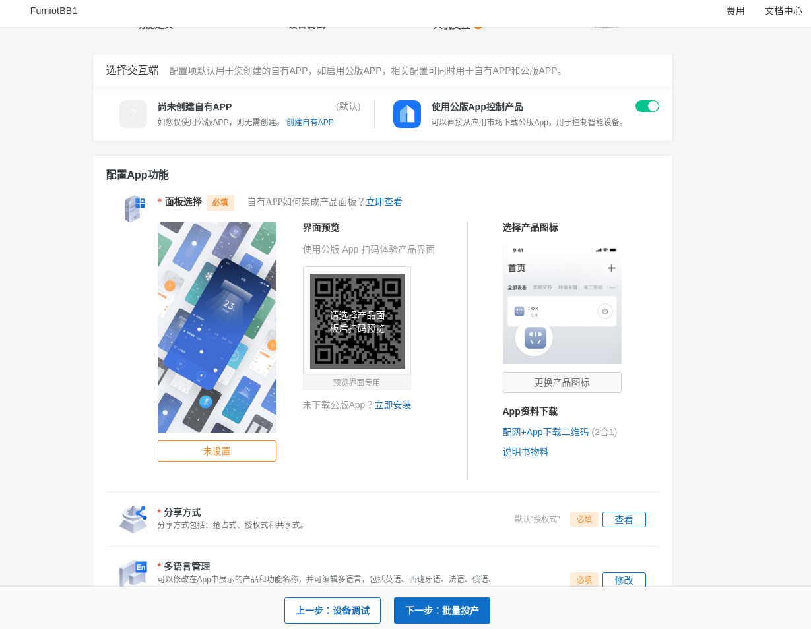
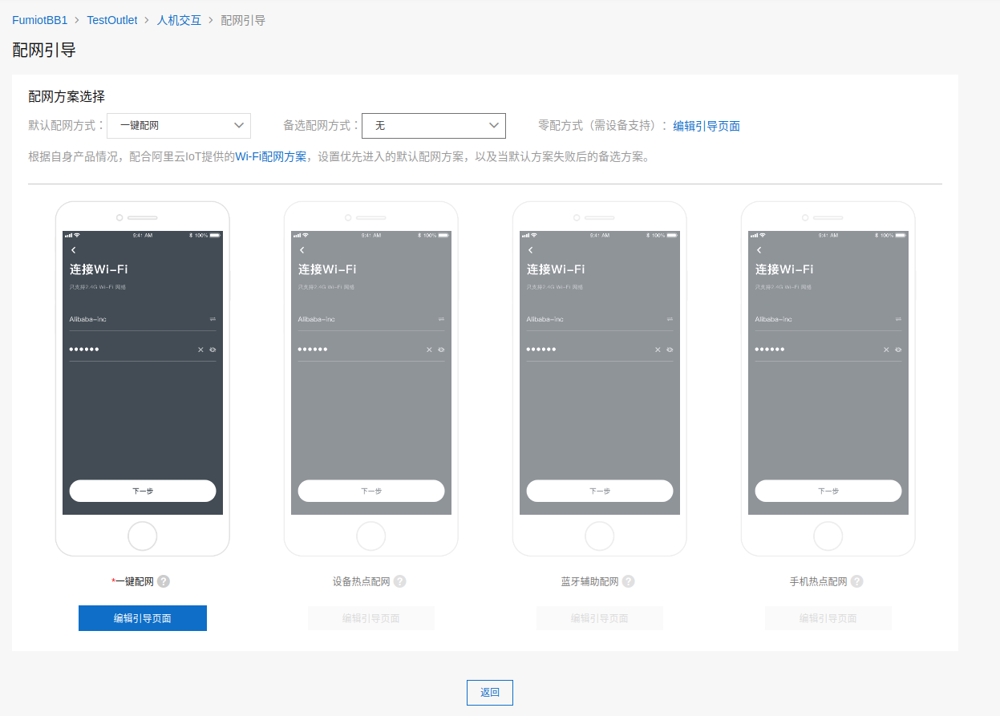

---

<center><font size=10>管窥物联网技术</font></center>

<center>(Rev_2021Q2)</center>

# 概述
物联网技术把灯、插座、冰箱空调、车辆、工业控制器等"物"联入互联网，用户通过手机APP对它们联网控制，云端基于上报的大量数据能够对设备还能形成“智能”化的自动控制。2015年以来，强劲的市场需求推动物联网SoC器件和物联网云端服务飞速发展。联网的电器很容易提供一些“智能”的功能，比如灯的定时开关、场景联动等等，市场上常常把这些联网的“物”称为“智能”的。比如，智能灯、智能音箱、智能插座、智能冰箱等等。

直到2010年代早期，Arduino的Wifi模块还需要百元左右，比主控板还要贵。物联网产品稀少，云端平台功能单薄。2015年后，ESP8266等廉价Wifi芯片的推广伴随着物联网市场的井喷，为物联网技术带来更多关注，也为研究者和玩家提供了更多的机会。掌握物联网技术，意味着在一个蓬勃发展的行业拥有一席之地，学习把玩的同时可以搭建一些有意思的联网智能装置。

局域网里面的两个网络节点，如连到一个热点的手机和设备，能够直接使用各自的本机IP地址互通，无需第三方节点的辅助。相对比，物联网系统基于电信运营商提供的公众网络服务，网络结构复杂，任意两个网络终端节点之间几乎无法建立直接的网络连接。微信QQ、钉钉等网络应用程序都会需要用户先连接并登录到一个公共的服务器，通过这个服务器的中转协调，在终端用户之间建立通信。与之类似，物联网系统也需要一个相对集中的云端服务，用来给予每台物联网设备一个网络帐号，管理和维护物联网终端设备、所有者、应用系统之间的关联，以云端服务为纽带建立整个系统各种节点之间的互联互通。在这个层面上，我们可以把物联网系统理解成一个让物品能够登录在线的即时通信系统，在这个系统中，物与物，物与人，物与应用系统之间近乎实时地交换信息，在互联网所及的范围之内，实现对物和过程的智能化感知、控制和管理。

构建物联网系统需要我们设计开发设备端软硬件、云端服务和手机APP。满足消费品成本约束的物联网设备端，必须能够以远低于手机/电脑等网络终端的价格实现网络接入，否则无法达成足够广泛的场合覆盖。相对于手机/计算机的硬件平台标准化通用化程度，物联网设备的硬件平台品种多样，资源更加紧凑，软件形态是嵌入式软件，开发调试难度相对较高。

这几年来，谷歌、亚马逊、微软、阿里、华为、腾讯等网络巨头都在物联网领域发力，构建了自己的物联网云平台，定义了物联网系统的一般架构和基础服务，提供了设备端软件SDK或者嵌入式OS，形成了物联网系统的共性基础设施。有些物联网云平台提供了比较低的接入门槛，开发者能够免费接入数十个物联网终端节点，足够学习研究，产品样机的开发调试使用。

# 本文的内容

本文基于FUMIOT&reg;对于物联网技术的研究工作（截至2021年第一季度），目标是讨论物联网技术的一般原理和应用。犹如讨论计算机技术不能避开Intel 8086和IBM PC，我们的讨论也会涉及具体的基础产品厂商，如在物联网SoC芯片市场影响力较大的乐鑫esp8266和esp32芯片。物联网云平台方面国内尚没有出现呈现明显优势的云服务商，不失一般性地我们选用了阿里云的服务。如此管窥难免有其局限性，但是我们依然会尽量对一般的技术予以阐述，这些一般的技术原理适用于基于其他的厂家的物联网基础产品构建物联网应用解决方案，如庆科、beken、csky等厂家的SoC芯片，亚马逊、百度云、腾讯云、微软Azure等厂家的物联网云平台服务。

物联网云平台定义了一套物联网设备接入的协议，正如同早期互联网上流传的一句话，“在网上，没人知道你是一条狗”，云平台并不知道按照协议接入的设备在物理上的实际形态。平台上显示在线的一盏灯，可能是一台PC机，也有可能是一个Android手机级别的”胖“嵌入式设备。本文考虑物联网设备端基于在消费市场有意义的资源紧凑嵌入式架构，这类设备的嵌入式最小系统的BOM成本会低至几元人民币，功能强一些的也不会超过30元人民币（2021年），其软件开发与PC、手机等通用硬件上软件有着较为显著的差异。

本文结合可联网运行的智能灯/插座、环境温湿度监控两个物联网系统示例，讨论IoT系统架构、IoT开发环境、工具和调试技术、硬件接口技术、传感器应用、通信技术、RTOS、网络安全技术、测试验证、嵌入式开发技术、程序设计技术（构建之法，软件工程）等构建和维护物联网应用系统所需要的各种知识与技能。示例采用Alios Things+乐鑫WiFi Soc搭建物联网设备，接入阿里云物联网平台，支持云智能公版手机APP。[硬件设计CAD图和软件源代码](https://github.com/fumiot/bb1)均以在github开源，欢迎下载与反馈意见。

# 预期读者
可供设计开发智能家电、工业物联网等物联网应用系统的产品经理、项目总体、嵌入式开发者、云端web应用开发者、手机APP开发者参考。读者需要基本的C语言能力，有一定的单片机和互联网前后端应用开发知识。
对于面向具体方面深入理解和定制需求，需要以下的具体技术基础：
* 设备端：单片机、C语言相关技术;
* 应用服务端：基于Java或Python的Web服务开发技术;
* 手机APP：Android（Java）、iOS（Objective-C）手机App开发。

# 免责声明

本文提供的内容、源代码是“原样”提供的，FUMIOT&reg;不对其使用或性能作出任何保证。其中包括任何明示的或默示的适销性、特别用途适用性或无知识产权侵权保证。FUMIOT&reg;不保证使用本文和相关软件所获的性能和结果。FUMIOT&reg;及其供应商不就任何事项做出保证、条件、陈述或条款（不论是明示的或默示的，无论是依据条例、普通法、惯例、常例，还是其他任何原因）包括但不限于不侵犯任何一方权利、适销性、完整性、满意的质量或适用于任何特殊用途。

# 版权

本文的版权协议为 [CC-BY-NC-ND license](https://creativecommons.org/licenses/by-nc-nd/3.0/deed.zh)。


# 1. IoT系统架构

IoT系统架构与传统的上位机+单片机构成的多机系统有相似之处。传统的多机系统一般由少量的通用计算机规模的中心节点和大量的单片机控制的设备终端节点构成，其通信网络一般是面向应用专门布设的有线或者无线网络，中心节点与终端节点之间可直接通信，终端节点之间通信交互较少或者没有。IoT系统在应用层面上看起来也是如此，大量的设备节点，少量的用户节点，用户通过手机或者电脑上的应用程序遥控自己的设备。物联网设备一般24小时在线，加之Internet在网络结构上的复杂性，物联网设备一般不直接与用户的手机或电脑通信。物联网设备的直接通信对象一般是云端服务，这个服务可以是云计算服务商提供的物联网云服务，也可以是部署在私有的公网服务器的专有后台应用。手机和电脑也通过这个云端服务开放的API访问和管理物联网设备。

系统的一般架构如下图所示：


多数物联网设备有着一般物品加上物联网控制功能的形态，比如共享单车采用的自行车加物联网车锁，物联网智能灯是普通灯泡加上智能控制板。物联网设备可以采用多种方式连接Internet，最常用的是Wifi或者蜂窝网络（4G、5G），需要的基础设施就是我们常用的Wifi路由器。设备也能采用蓝牙BLE、Zigbee或是有线以太网、RS485等其他通信方式，此时需要部署相应的网关设备，将通信数据转接到Internet。

物联网设备端的硬件平台和云端服务都有着多样的选择。目前可供选择的物联网SoC芯片厂家有：乐鑫、庆科、RealTek、芯之联、锐迪科、南方硅谷等。乐鑫esp8266和esp32在Wifi SoC中有着较大的影响力，相关的国内外开源社区活跃度高，资料相对丰富，是学习和研究物联网技术的较好选择。量产产品方面，其他厂家的器件也有着较强的竞争力，这些器件厂家也在适配不同的物联网云平台方面作出了必要的工作，在应用框架设计时应尽量减少对具体厂家器件的依赖，以期获得供应链方面的灵活主动性。

目前互联网巨头提供的物联网云平台已经具备了较完整的接入管理功能，脱离它们开发完全独立的物联网云端后台服务无论在技术上还是经济上都不再是划算的选择。近年来逆全球化之风刮起，考虑相关管理政策的因素，面向国际市场的物联网产品应接入谷歌、亚马逊、微软等厂家提供的云服务，面向国内市场的产品可以在阿里、百度、腾讯、华为、小米、京东等厂家之间选择。

阿里物联网平台的架构如下图，其他厂家的云平台架构大同小异。


架构方面，物联网SoC厂家和云服务厂家都在试图占据主导地位。乐鑫ESP-IDF之类由芯片厂家维护的框架会提供适配不同云平台的解决方案和示例。与之相对应，在互联网大厂的物联网云平台上创建和定义产品时，云平台也会提供多个厂家的模组/芯片供开发者选择，云平台提供的嵌入式框架（物联网SDK或者RTOS）也会尽可能地适配多种芯片。可以预期的是，从芯片厂家的框架出发开发物联网设备会得到较好较全面的芯片外设驱动方面的支持；反之，从云平台厂家提供的嵌入式框架出发，会更容易完成与云平台及其手机APP之间的联调，在芯片外设驱动方面则常常会需要付出多一些的工作。值得一提的是Esp RainMaker，这个解决方案基于乐鑫与亚马逊的合作，利用芯片内置的安全硬件，开发者可以免除云平台相关配置管理工作，可以直接使用手机上RainMaker APP，对采用ESP32器件的物联网设备进行Wifi配网和绑定，值得一试。

物联网系统是一个比较庞大的分布式系统，面向可运行的实际范例，运用软件调试器打断点观察变量、无线和网络通信与协议抓包、硬件时序与波形分析等工具和手段，对系统关键结合部进行深入的观察分析，能使我们更准确更快速地理解系统的关键机制和设计依赖，这些知识与能力是我们设计和开发IoT应用所必备的。

# 2. IoT应用开发
本章节简要讨论设计开发一个物联网应用系统整体上涉及的一般性工作事项。
基于第一章所阐述的IoT系统架构，对于具体的IoT应用开发而言，IoT基础构件如芯片、云平台、设备端SDK等等一般可视为已有的基础设施，应用开发者需要了解相关技术特性和使用方法。应用开发工作主要涉及以下几个方面：
     1.系统分析与设计
     2.软件总体设计
     3.结构设计
     4.硬件设计     
     5.嵌入式软件设计
     6.云端开发
     7.APP开发

## 2.1系统分析与设计：
系统整体功能定义，系统总体架构，硬件选型，物联网云平台选择。
物联网系统在通联方面的复杂性主要来源于互联网自身的复杂结构，到2020年，互联网大厂提供的物联网云平台均能够较好地封装处理这种复杂性。系统分析设计的主要任务是明确系统的功能，明确系统功能在物联网设备端、手机APP、云端的网页应用、云后台服务这三个独立的软件之间的分配，明确这几部分软件之间交互的信息和接口定义。系统分析设计阶段还应该考虑面向厂家的可生产性和可管理性。系统分析与设计的层面，物联网云平台的服务特性、物联网设备端嵌入式系统的特性、移动APP侧与物联网云平台接口的特性是物联网应用总体设计层面有独特性的方面。

需求管理是构建软件系统的起点，再简单的系统，都应该从一个成文的需求规格说明开始设计开发工作。功能的取舍总是一个痛苦的抉择，游移不定的需求永远不能达成一个可用的系统。

以最简单的智能灯/插座为例，消费者会通过手机APP控制灯，不大可能用电脑登录网页做这件事，所以我们一般不必为智能灯定义网页应用。系统简化为物联网设备端和手机APP两个面向最终用户的实体，云后台服务直接使用云平台功能。

系统分析是构建大型实用的物联网系统必经的阶段，对于技术爱好者的即兴创作，似乎是屠龙之技和杀鸡之牛刀无甚大用。然而，对易于构建的爱好者小型应用系统进行解剖麻雀式分析，运用正规的设计开发管理流程，无疑是有益于我们在解决正式的商业项目运用这些方法，毕竟稍有规模的企业，即便是为了应付质量体系有关的外部标准，也必须建立规范的设计开发过程。

对于学习者和爱好者，好玩有趣是学习研究过程中的关键要素之一，可以选择有较为成熟的社区支持的开放平台，从易于搭建的完整示例出发，先照着葫芦画瓢原样搭建，运用调试工具分析和解决修改定制自己所需要的功能。

可以考虑如下的路线图构建更有趣的应用：
智能开关+远程视频+下料器=宠物投喂器。
智能开关+温湿度传感器+水泵 = 远程浇花。
初始的系统设计可以用草图描述，严谨的系统方案需要需求定义开始，尽力先固化需求，再深入开发。无具体应用目标的摆弄，能得到一些技能和知识，但不会得到有用的产品。

系统分析阶段应考虑无线链路的规划。无线频谱是有限的资源，遵照相关国家和地区的无线电频率管理规定，物联网系统能够使用的频段是有限的。以2.4GHz频段为例，Wifi和蓝牙都在使用这个频段。在任意地点进行空中信号观测，目前在人员密集的城镇地区，可见整个2.4GHz频段十分拥挤，远距离弱信号连接会十分困难。当前的Wifi物联网SoC都工作在2.4GHz频段，需要可靠的连接时，必须仔细分析整个物联网系统中无线信号环境，确定系统所需Wifi热点的布放。对于其他频段，同样存在类似的问题。总的讲，无线信号频率越低，信号穿透性越好传输距离越长，频谱资源相对紧张，传输速率低，容易遭到干扰；反过来，更高的频段频谱资源丰富传输速率高，但是信号穿透性差传输距离短，可以采用定向传输手段增加距离降低干扰。

主要的云平台、成熟的技术社区都提供了一些完整的系统级物联网应用示例。应该以这些示例为基础，学习研究物联网应用开发的方方面面。
本文提供的两个完整示例，相关步骤经过了测试验证，建议读者按照步骤完整搭建。其中，云平台相关操作基于2020年11月的状态，云服务商可能会修改相关界面，详细的界面元素和截图可能会与当前的状态有所出入，如有问题敬请通过FUMIOT微信公众号留言、git评论等方式给我们反馈，我们会根据实际情况予以更新相关内容。

## 2.2软件总体设计

构建物联网系统包含大量的软件开发工作，系统层面的复杂性较多地呈现在软件方面。软件总体设计要在云端、手机APP端、设备端分解系统功能，定义这几个相对独立构建的软件之间的接口。如果手机端使用公版APP，多数接口都是由云平台方预先定义好的，总体设计工作会简单得多。

## 2.3结构设计
面包板搭建阶段基本无需考虑这个问题，有需要时可以拿乐高式的积木拼出一个盒子。正式产品要充分考虑，但是基本上是传统电子产品的结构设计问题，物联网设备需要特别关注的是通信天线在整机结构中的安放，这个问题会影响通信质量和设备的电磁兼容性（EMC）。

## 2. 4硬件设计
物联网设备的硬件设计是一个典型的嵌入式硬件的设计，特别的是物联网硬件一般有WiFi、蓝牙等无线通信接口，这里按照芯片厂家的文档进行开槽和布线避让即可。硬件架构层面需要评估决策是采用单片物联网SoC解决方案，还是普通单片机+无线通信模块的解决方案。无线通信模块一般也就是一个烧录了特定固件的单片物联网SoC，所以从硬件成本的角度，显然单片SoC解决方案更优。但是在已经基于通用单片机构建了大量软件资产的场合，采用额外的无线通信模块显然更合适。对应本文的学习用途，我们采用ESP32开发板（核心板）、传感器模块和面包板搭建物联网设备硬件。

## 2. 5嵌入式软件开发
物联网应用开发与常规网络应用开发的主要差别之处在于物联网设备端的开发工作。物联网设备端本质上可以视为传统单片机系统+物联网SDK，物联网SoC厂家和云平台厂家分别自己的立场出发，提供了整合的设备端嵌入式系统框架。尽管这些框架殊途同归，最后实现的功能都是类似的，但是选择不同来源的嵌入式系统框架，一般会使得物联网解决方案要么与特定的SoC芯片绑定紧密，例如ESP-IDF与乐鑫芯片的绑定；要么和特定厂家的物联网云平台绑定紧密，例如AliOS-Things与阿里云物联网平台的绑定。如果想要两端同时解耦，则需要在系统设计层面相应地加入额外的抽象层隔离差异。

Arduino是全球有影响力的开源硬件平台，最早基于Atmel公司的AVR器件开发，硬件EDA设计采用免费版的Eagle，软件采用GNU开源工具链，硬件设计图和软件驱动库全部开源。Arduino社区海量的硬件驱动库，解决了基于单片机构建嵌入式系统时，繁琐的底层硬件寄存器级的配置和操作，各种传感器、执行器等外部设备基本都是面包板上按图插好几根线，用户使用几句C语言函数就能跑通点亮，其简单易用性得到了全球电子爱好者的广泛认同。采用独立无线通信模块架构时，可以使用一块标准的Arduino主控板，如UNO。对于单片物联网SoC硬件方案，ESP8266和ESP32都提供了Arduino插件，使得有Arduino经验的读者可以继续使用熟悉的环境构建物联网设备端。

## 2. 6云端和手机软件
云端和手机端APP的开发主要基于传统移动互联网应用开发技术，物联网云平台为物联网应用所需的用户和设备管理提供了相关的API。

## 2. 7剖析示例系统
极速入门系统的搭建，十分钟建立：无需任何硬件，用计算机充当物联网设备端。我们可以验证云端服务的搭建正确性。

快速入门系统的搭建，30分钟，没有硬件的同学需要加上等快递的两三天时间。

示例物联网应用系统，linkkitapp，观察物联网设备与云端的互动，观察物联网设备与手机APP的互动。我们选择esp32的原因，start kit,develper kit缺少持续的维护，esp8266官方对jtag的支持不佳，引脚数量也太少。

# 3. 工具和调试
工欲善其事，必先利其器。物联网系统是包含嵌入式终端、手机APP、云端服务的较大规模分布式系统，开发和部署过程中出现这样那样的问题是难以避免的。这些问题的来源，硬件上有接触不良或者断裂的导线、虚焊、不一致的接口模式设置、损坏的IO端口等等；软件上有输入超限、未初始化的变量、字长不匹配，野指针等等。调试工具好比是医生的CT、超声波、手术刀与缝合线，利用这些工具，我们能够观察和理解系统的运行机理，发现问题根源并且解决问题。
## 3.1搭建开发环境

设备端嵌入式软件开发环境有两种安装来源可以选择，一是来自芯片厂家提供的SDK，二是云平台厂家提供的环境。安装方式按照厂家文档指南逐步进行即可，Windows环境一般会下载运行几个exe安装包，Linux环境一般是git clone一些资源，网速好的情况几分钟就搞定。

手机端开发环境就是通用的Andriod或者iOS的开发环境，按常规安装，集成云平台厂家提供的物联网API库，编译运行一个demo即可验证环境的可用性。

云端后台应用的开发基于网络应用的Java、Python等语言和环境，有些工作可以在云端开发环境中以可视化方式完成，复杂的应用还是需要编写云端运行的代码。云端技术是物联网云服务厂家的长项，云服务厂家会提供比较详尽的API文档、示例和相关开发工具。

## 3.2硬件工具
除了基础的万用表烙铁套装，最好能配备逻辑分析仪之类的波形测量仪器。观察快速变化信号示波器和逻辑分析仪在过去十分昂贵，其不菲的价格曾经是个人学习硬件技术的主要障碍之一。那时即便是最基础的示波器，动辄需要花费工薪阶层半年以上的积蓄。现在不到300元人民币就能获得足够一般的学习与产品开发所需的示波器和逻辑分析仪，这两样东西是理解和分析解决硬件问题的利器。

万用表最常用的用途是检查连线的通断，检查电源电压，检查工作电流，查看缓慢变化的信号，也能观察到pwm信号的均值。
示波器能够测量分析信号的波形，数据传输问题一般需要确认波形的正确性，帮助隔离问题。示波器观察到的波形用肉眼常常不容易解读其对应的数据， 逻辑分析仪能够把波形译码为数值，解析常用的通信协议，与软件内存变量的值映证分析定位问题之所在。

## 3.2软件调试工具
最基本也是必备的是usb转uart串口，开发计算机通过这个接口下载可执行映像（固件）到设备上，观察设备输出的LOG信息。简单的问题能够通过观察LOG信息得到处理，略复杂的问题就会低效甚至不可行。特别是需要研究软件框架机理时，靠串口输出的LOG信息总会使人眼花缭乱，难以追踪到要领。此时，需要使用仿真器建立jtag调试连接。物联网设备SoC或者MCU一般具备jtag调试接口，开发计算机上的调试器软件如gdb成功连接目标设备后，就能够在感兴趣的源代码处打上断点，让程序停在断点处，观察实时的变量值，让程序单步执行，以及回溯查看调用栈分析程序机理，解决存在的问题。

有些开发板，如ESP32-Wrover-Kit，板载JTAG仿真器电路，插上USB线就能挂仿真打断点调试。便宜的核心板如esp32devkitc，需要外接JTAG仿真器。因为国情缘故，很多同学在做ARM的时候有了几十块的廉价Jlink仿真器（存在版权问题），esp32支持用它进行jtag调试。基于FTDI的FT2232 、FT4232器件的JTAG仿真器同样价格低廉，且没有版权方面问题，速度能够达到20MHz以上，没有Jlink的同学值得配备一个。

# 4. 物联网硬件

## 4. 1硬件总体设计

物联网硬件主要采用无线通信方式，最常用的就是Wifi和运营商提供4G、5G蜂窝网络。其他无线通信技术，如ZigBee、NFC等等，需要开发部署相应的网关设备，通过网关的网络连接能力，把设备接入互联网。通信方式的选择是成本、通信范围、速率、可靠性、功耗等要素的综合决策。

物联网硬件设计的目标是提供设备端嵌入式软件的运行平台，满足外部通信、人机交互、传感器和控制执行部件的物理要求。物联网应用系统整体复杂度较高，为了在系统研发过程中有效地管控系统的技术状态，应采用尽早联调、持续构建集成的策略进行系统的设计开发工作。

为了达成这一点，硬件可以采用面包板->洞洞板（可选）->PCB制板逐步演进的策略。

物联网硬件设计决策主要源自系统功能需求，其次是已有技术背景和云平台架构的选择。功能需求决定了我们需要多少硬件资源，从而约束了硬件总体设计和器件选型。硬件主控处理器可以是传统的通用单片机，也可以是较新的物联网SoC芯片。采用通用单片机作为主控处理器时，硬件也就是增加了一个无线模块；WiFi、4G等无线功能本身需要比较强的计算能力，所以这些无线模块有些基于物联网SoC芯片构建，有些在模块内置了一片较强的通用单片机。这些无线模块具备数量不等的GPIO、UART、I2C和SPI等通用外设接口，在接口数量满足要求时，可以采用以物联网SoC模组/芯片作为主控的硬件方案。
无线通信接口涉及相对复杂的天线和射频相关的结构和布线，物联网SoC芯片供应商都提供了小尺寸的邮票孔焊盘形态的模组。使用这个模组时，PCB只需对天线区域进行必要的布线避让即可。直接使用芯片时，应按照厂家给出的参考设计画PCB天线等射频单元。

这些模组的参考选型：（阿里云清单引用，编辑一下）

模组布放在PCB上的布局示例：
1. esp32devkitc
2. esp wrover kit
3. iot developer kit
4. XLWM产品示例。

对于没有可继承既往设计的新产品，硬件设计可以从参考开发板和其他类似产品开始。对于学习研究任务，开发板是当然的选择。
## 4. 2面包板硬件系统搭建
用现成的硬件模块，在面包板上搭建硬件原型机验证硬件快速且灵活易于调整。Arduino支持的传感器等硬件驱动库丰富，硬件模块的驱动问题可以使用Arduino辅助调试。硬件系统的构建有以下几个方面：
### 4.2.1电源和最小系统

嵌入式领域常常用最小系统表示能够下载运行一个最简单程序的硬件。最小系统包括电源、CPU、ROM（一般是Flash）、RAM、复位电路和主时钟。因集成度的差异，除电源之外的部分不同程度地集成到单个芯片之中。很多ARM单片机包括了CPU、ROM(Flash)、RAM和复位电路，外接晶振和电源就构成了最小系统。一些时钟精度要求不高的场合，使用片内RC振荡电路连晶振都能省掉。ESP8266和ESP32这样的物联网SoC器件片内集成了几百KB的RAM，需要外接Flash作为程序存储器，Wifi通信需要较高精度的时钟，需要使用外部晶振，这样的最小系统包括主控芯片（物联网SoC)、Flash、晶振和电源。调试这个最小系统只需要一个外部USB转串口小板，用万用表检查一下电源接线是否存在短路，用欧姆档测电阻有几百欧以上就能够加电，下载Hello World，观察串口输出。接线正确无误，运气不那么糟糕无元器件故障时，会得到下载成功，在串口终端看到Hello World输出。如果使用包含有USB转串口的开发板，如NodeMCU 8266或者NodeMCU 32S，最小系统就是现成的，接上USB线，上位机软件选对串口就能下载和测试Hello World。
如果不顺利，首先检查仔细检查接线，测量电源电压，工作电流是否正常。正常的工作电流在数十到一二百毫安之间。因为无线发射功率的缘故，物联网SoC功耗比通用单片机要大一些。考虑20dBm的发射功率，加上天线损耗，光是射频相关的功耗就会接近100mA，所以首先需要确保电源有足够的功率。接下来容易出问题的地方是串口收发线接反，可以把TXD和RXD两根线调换一下试试。

### 4.2.2数字量输入输出

数字量输入主要是按键，输出会用来控制LED、继电器等开关状态的外部设备。最简单的接线可以参考各种开发板，按键输入电路一般可以直接引用，需要控制大功率负载的输出则需要设计必要级数的开关电路，直到末级开关器件的驱动能力满足负载的需求。

### 4.2.3模拟量输入输出

模拟量输入一般源自各种传感器，模拟量输出用于控制有连续控制参数的执行机构。传感器把真实世界里的物理量、化学量或生物量等信息转换成微处理器能够读取和处理的电信号。传感器的最前端是敏感元件，敏感元件利用某些材料或结构固有的物理、化学或生物效应，把被测的量转换成电压、电流等电学方面的量。有些敏感元件能够把相关物理量转换成电信号或电特性的变化，如光敏电阻、热敏电阻；有些敏感元件先把物理量转换成易于转换成电量值的其他中间物理量，如压力表首先把压力转换成弹片的形变，弹片的形变通过滑动变阻器再转换成电阻值的变化。传感器最先转换出来的电信号一般是模拟信号，模拟电压或者电流的值与被测量的值有着一一对应的函数关系。通过模数转换（ADC）获得电信号的值，按这一函数关系即可计算出被测量的量值。由于元器件个体的差异，这一函数关系一般也有着个体差异，因此，传感器输出的原始模拟信号一般需要经过校准，才能正确推算实际的测量值。模拟接口的传感器需要连接微处理器的ADC引脚，微处理器上的软件需要完成相关的物理量测量函数转换和校准。
集成度更高的传感器芯片集成了模数转换和数字接口电路，微处理器使用SPI、I2C等数字接口就能够直接读取测量结果，电路和软件设计开发难度较之直接处理模拟信号大大降低，是构建物联网设备的首选。

### 4.2.4硬件驱动和验证
没有被适当的驱动程序配置和打开的硬件是毫无用处的。硬件驱动历来是构建嵌入式系统中的一个麻烦事，硬件人员容易欠缺软件调用者的视角，多数软件开发者不会关注到外设寄存器、电平和波形这些很“硬“的要素。搭建原型机应该选用有现成的硬件驱动库的传感器等外设模块，最好按照驱动程序文档定义的连线原样接线，搞通了再去做调整。Arduino平台下的外设驱动丰富，硬件的驱动和验证环节可以在Arduino环境下先行。验证通过了，可以保证硬件本身的正确性，能够降低适配其他嵌入式软件框架的复杂度。依照其他框架示例搭建的硬件可以不经过此步。
插接线不牢靠，振动和表面的氧化污损，多几块难以保证一致性，面包板不会支持很久。正式一点的项目，需要在面包板阶段同步进行PCB设计，根据面包板调试验证之所得，修订原理图和PCB图，硬件主要疑难点得到验证后就可以投板制作PCB，采购元器件电装。


## 4.4正式硬件设计

### 4.4.1结构设计
正式硬件应与外壳等结构要素结合开展，结构设计的输出会给定电路板的尺寸、装配定位等机械方面的设计约束。
### 4.4.2PCB设计
调试验证原型的过程中，可以在EDA软件中同步绘制和修订原理图。在面包板/洞洞板硬件上完成主要功能性能项的验证之后，就得到了第一个状态确定的硬件原理图。基于这个原理图，结合结构设计给定的尺寸、空间高度、定位孔、外部接口位置等设计约束，可以展开PCB图的设计工作。
### 4.4.3环境适应性
物联网设备产品在其使用中，会经历高低温、高湿度、冲击振动等环境变化，有些还要面对户外的日晒雨淋。结构设计、元器件选型、生产加工工艺要充分考虑设备所面向的环境，按照相应的国家标准，确定各项环境适应性要求，例如工作温度-10～50‘C，存储温度-30～65’C等等具体参数。有条件的在设计阶段应该做热仿真，及时验证硬件设计的环境适应性水平，降低实物质量风险。产品在出货部署之前，应开展环境试验，按照相关标准规范的要求，模拟实际可能经历的场景，给试样施加相应的环境应力，实测验证产品的环境适应性。要取得权威的第三方认证，还需要有资质的环境试验室经历相应等级的测试验证，通过验证才会得到所需的证书。

### 4.4.3电磁兼容性
物联网设备部署的现场电磁环境一般都会比研发试验室来的复杂。设备的附近有可能存在敏感的其他重要设备，如心脏起搏器、其他无线通信系统、电子仪器仪表等等，设备不应发射出过强的干扰影响这些设备正常工作。附近也可能存在强的电磁干扰源，如接触器、电机或大功率无线电发射装置，设备不应过于敏感以致于出现误动作、死机等故障。中国、美国、欧盟、日本等国家和地区的政府都为电子产品制定了电磁兼容性相关的标准，这些标准规定了电子产品以传导和辐射途径允许发射的电磁干扰上限，也规定了产品必须能够承受的外部电子干扰下限。

电磁兼容性工作可从三个层级视情况开展。一是遵循一般的电磁兼容性设计原则，这个难度最低，成本最低，做到了能够很大程度上避免发生电磁兼容性问题。这些原则有：

xxxx，多层板，敷地，缩短时钟信号线，差分线，地环路控制。

二是基于定量分析的电磁兼容性设计，手工概算，计算机仿真计算，基于计算结果，调整设计，直到满足要求。三是电磁兼容试验，在微波暗室中，实物测试，调整设计，直到满足要求。

### 4.4.4可靠性
硬件要早验证，充分验证。大量的物联网设备一旦分散部署到用户现场，硬件问题的修复处理成本在时间和经济上几乎是任何人都无法承受的。硬件可靠性的一般计算，元器件失效率的和。设计上的一般原则。

# 5. 物联网设备端软件开发
## 5. 1概况
物联网设备端软件一般是嵌入式软件，其二进制映像又称为固件。物联网系统因为要对接云端服务，由于网络和安全性等方面协议的固有的复杂度和规模因素，物联网设备固件大小一般在数百K字节以上，考虑OTA升级需求，设备所需flash器件容量至少要达到固件大小两倍，故所用的flash器件一般都是兆字节级。相应地源代码规模也普遍复杂庞大，也使得像51单片机那样，不依赖已有较大规模框架建立源代码工程几乎不再可能。

物联网硬件相对稳定，尽管一旦有硬件问题会比较棘手，但是硬件变更要素并不多。软件工作会耗费大量的资源，软件变更频繁，变更要素多，状态变更频繁。合适的软件基础框架，能够显著降低应用软件开发的复杂度和工作量。

设备端软件框架的选择。
1.物联网SoC厂家提供的框架，如乐鑫的ESP-IDF，庆科的MiCO；集成云平台SDK接入物联网云服务。
2.云平台厂家提供的框架，如AliOS-Things，百度云IoT，腾讯IoT；
3.Arduino，必要时配合硬件扩展包和云SDK库。


充分评估，选定适当的示例作为起点，项目所需的基础公共构件尽量以剥离拼合方式逐块加入，然后加入项目应用代码。

不同的框架对应了一套工具链/构建系统的配置。这些构建系统之间有些还存在冲突，例如截至2021年第2季度，乐鑫的ESP-IDF的构建系统基于python3，阿里的alios-things则基于python2.7，共存时就需要按需切换系统的python版本。一个解决方法是把编译构建环境部署在独立的虚拟机中，或者直接docker等部署带有环境的虚拟机映像。

快速打通物联网与云平台，可以走一下三个路径之一：
1.使用物联网云服务商提供的设备端RTOS，如AliOS-Things。
2.使用芯片厂商的开发环境+云平台示例，例如ESP-IDF加esp-aliyun示例。
3.使用Arduino+含有云接入固件的Wifi模块。

## 5.2 物联网云服务商提供的嵌入式OS
### 5.2.1概况
基于物联网云服务商提供的嵌入式OS，能够较快地完成物与云的联调。示例程序包含有设备联云平台的代码，读者用自己在云平台注册申请来的设备名称、设备密钥等，一般就是几个字符串，把示例中的相应宏定义值替换掉，很快就能在云端看到设备的接入情况，以及设备上报的数据。

物联网云服务商提供的嵌入式OS构架独立于特定的硬件MCU平台，通过统一的硬件抽象层(HAL)隔离底层硬件差异，面向每种具体的MCU需要实现相应的一组HAL函数。市面上MCU品类繁多，平台提供的设备端嵌入式OS需要实现大量的HAL。HAL实现的充分性实际上反映了硬件厂商与云服务厂商之间关系，以AliOS-Things为例，对庆科的模组支持较为充分，HAL目录下的对应硬件接口和外设的驱动实现较为完整。但是，对ESP32的实现就不那么充分了。在具体项目层面上，需要按照项目需求和硬件驱动开发能力综合权衡。

### 5.2.2互联网巨头的物联网设备端RTOS：
* [亚马逊 Amazon FreeRTOS](https://aws.amazon.com/freertos/)

* [微软 Microsoft Azure RTOS](https://github.com/azure-rtos/getting-started#getting-started-with-azure-rtos-and-azure-iot)

* [谷歌 Google Cloud IoT](https://cloud.google.com/solutions/iot)

* [阿里 AliOS-Things](https://github.com/alibaba/AliOS-Things
)

* [华为 LiteOS](https://www.huawei.com/minisite/liteos/cn/)

* [腾讯 TencentOS tiny ](https://cloud.tencent.com/product/tos-tiny)

* [小米 Vela](https://iot.mi.com/vela/detail.html)

* [京东（采用RT-Thread）](https://docs.jdcloud.com/cn/rt-thread-for-jd/product-overview)


### 5.2.3AliOS-Things
对于云平台提供的RTOS，本文以AliOS-Things为例展开较深入的探讨，在Baidu和Tencent的RTOS中也可以看到类似的架构。云平台提供的RTOS要么直接与现有的有影响力的开源RTOS集成而来，如aws freertos，要么在这些开源rtos技术的基础上自行开发，如alios-things，它们的架构的功能有着诸多相似之处。

AliOS Things的1.0版本于2017年10月在杭州云栖大会上发布1.0，目前已经演进至3.3版本(2021年4月)，源代码地址：[github仓库](https://github.com/alibaba/AliOS-Things)，[国内gitee镜像](https://gitee.com/alios-things/AliOS-Things)。2.x版本之前均罗列有对大量处理器的支持，但是实际上很多器件的外设驱动支持并不充分。3.3版本主要支持阿里自己的HaaS100硬件。

AliOS-Thing集成了用于连接阿里云IoT的ALink协议，支持从阿里云端对物联网设备进行OTA升级。开发环境支持Ubuntu16.04至Ubuntu20.04，官方提供的安装步骤如下：

[Linux环境安装](https://help.aliyun.com/document_detail/161037.html?spm=a2c4g.11186623.4.1.10eb1c1eAt2rkl)

[Window环境安装](https://help.aliyun.com/document_detail/161038.html?spm=a2c4g.11186623.4.1.355e37e20nAwoy)

* 物模型

物模型是一个JSON对象，规定了“物”的属性、值的类型和范围等要素。物联网设备与云平台之间，按照物模型定义的属性格式，构建JSON字符串，交互系统所需的信息。如温度上报，设备会构建这么一个字符串“{Temprature: 23.6}”，云端会按照物模型规定的温度属性名称和单位解释这个字符串，在云端的物联网控制台、云端应用程序页面或者手机上会看见设备端温度被更新为23.6'C。反过来，云端下发的控制信息，如灯的开关，经过JSON解析会得到这样的一个JSON字符串”{LightSwitch : 1}“。设备按照收到的LightSwitch字段是1还是0,把GPIO引脚电平置高或者低，经过继电器等功率执行机构，使得灯亮起或是熄灭。

设备端构建上报JSON载荷数据的示例代码：
```
    cJSON *root = cJSON_CreateObject();
    if (root == NULL) {
        return ;
    }

    cJSON_AddNumberToObject(root, PROPERTY_SWITCH, ！relay_gpio_level);

    property_payload = cJSON_PrintUnformatted(root);
```
调用IOT_Linkkit_Report上报该载荷数据：
```
res = IOT_Linkkit_Report(user_example_ctx->master_devid, ITM_MSG_POST_PROPERTY,
                             (unsigned char *)property_payload, strlen(property_payload));
```
设备端串口可见相应的调试输出如下：
```
> {
>     "id": "2807",
>     "version": "1.0",
>     "params": {
>         "LightSwitch": 1
>     },
>     "method": "thing.event.property.post"
> }
```

设备端解析云端下发JSON数据的代码示例，这段代码第二行开始根据解析的结果，调用设备的relayOn或是relayOff函数，接通或者断开设备端的继电器，使得灯亮起或者熄灭：
```
    property_switch = cJSON_GetObjectItem(request_root,PROPERTY_SWITCH);
    if(property_switch!=NULL)
    {
        EXAMPLE_TRACE("Parsed switch = %d\n",property_switch->valueint);
        if(property_switch->valueint)
        {
            relayOn();
        }
        else
        {
            relayOff();
        }
    }
```

* OTA

空中升级是物联网设备必备的功能之一，OTA功能基于器件Bootloader所支持的乒乓启动机制，两个程序分区交替使用。云端下发的固件映像总是写入当前的OTA分区，下载的固件通过校验机制的验证后，设备端的OTA代码会把当前OTA分区设置为活动分区，当前活动分区设置为OTA分区，然后软复位。复位后，总是会从最近成功下载OTA映像的那个分区启动设备端固件。

* 支持的硬件平台

AliOS-Things起初在硬件适配方面理想宏大，其目标是支持几乎所有具备足够速度和存储容量的硬件，从PC机直到STM32F103这么瘦的单片机，其1.0到2.0版本代码中platform目录囊括了市面上绝大多数的MCU型号。编译构建示例时，会自动下载所选硬件的编译工具链，开发者可以很快获得所有这些MCU的工具链，完成Hello World基本示例的构建。按照本文最后一章示例，在云端创建产品和设备，获得DeviceSecret等云端接入凭据信息之后，基于linkkitapp示例，也能很快打通板子到云端的连接，在云端看到在线的设备，以及来自设备的演示性定时上报数据。

进入实际应用项目开发时，开发者会发现现实没有那么美好。就拿Wifi SoC领域有影响力的ESP8266来说，直到2.1.0版本，OTA功能都存在BUG，使用linkkitapp示例程序构建出来的bin映像无法直接使用。

硬件驱动方面，以AliOS-Things为ESP32的i2c控制器提供的驱动代码为例，直到3.1.0版本，像hal_i2c_mem_write这样访问i2c传感器所依赖的关键代码里面只有寥寥2行:
```
{
     int32 ret = 0;
     return ret;
}
```

这两行代码的糟糕之处在于，开发者按照文档在图形化的配置环境中使能相应的I2C传感器，如BME280之后，编译链接不报错，运行的串口输出也不报错，但是从板子上连接的传感器中却得不到任何数据。

造成这样的问题的根源既有市场层面的也有技术层面的。市场层面上，MCU厂家并不会都乐见阿里这样的云端巨头的嵌入式终端操作系统能够隔离硬件差异，透明地支持各家MCU作为底层硬件。这意味着把硬件的选择权完全交给了云端和应用开发商，物联网设备上的嵌入式软件与硬件之间失去了粘性。落实到技术层面上，越强势的MCU(物联网SoC)厂家，在配合阿里开发硬件抽象层（HAL）的时候，越是勉强和不情愿，其提供的支持越是不充分。后发的硬件厂家往往又存在开发力量不足，难以全面充分完成所需的适配工作。

在AliOS-Things构架自身层面上，也存在分析不够充分的问题。依然以i2c传感器为例，系统构建的i2c传感器对象会包含并初始化总线控制器对象。这意味着每个i2c传感器会去初始化一个mcu的i2c控制器对象。这没有反映实际的硬件架构:i2c是总线式接口，一个mcu的一个i2c接口（对应一个i2c控制器）上，可以连接多个i2c从设备。在这种通用的i2c硬件连线方式下，AliOS-Things的传感器驱动架构无法采用合适的配置正确地驱动，设备端的开发者必须深入操作系统的底层，修改传感器的驱动程序，让第一个初始化的i2c传感器驱动程序初始化i2c控制器，其他传感器驱动只是引用这个控制器对象；或者单独初始化i2c控制器对象，所有传感器驱动都引用对应其连线硬件的i2c控制器对象。

* 权衡

没有完美的基础设施。尽管存在诸如上述的问题，AliOS-Things仍然在系统化地建设物联网嵌入式操作系统方面取得了有效的进展。基于它，开发者能够很快地构建一个打通了现场到公版手机APP的物联网应用，Wifi配网、OTA等功能可以算是达成了零开发量无缝集成，这些功能曾经是构建物联网系统的主要困难之一。同样地，维护这样一个宏大的系统对于阿里这样的巨头也是重大的挑战，让硬件驱动、嵌入式软件构建环境、云端物模型协议、云端OTA协议和云端服务同步演进，以合适的状态呈现在物联网应用开发者面前，依然不是那么容易达成的一件事。

## 5.3 芯片厂家提供的嵌入式框架
### 5.3.1 概况
芯片厂家提供的嵌入式框架，在片内外设的驱动程序方面相对齐全完备。芯片厂家会提供面向多家云平台的示例代码，设备端的接入方法是链接云平台方提供的连接协议SDK库。

### 5.3.2 ESP-IDF
ESP-IDF是乐鑫提供的嵌入式软件开发框架，目前的版本是v4.3。官方提供的快速入门页面包括了编译环境的建立和Helloword示例的构建与测试过程。

esp-idf采用了FreeRTOS，与亚马逊的iot云端服务集成度较高。由于使用了官方FreeRTOS，gdb调试时能够看到运行中的全部任务列表。

AliOS-Things之类与云端结合紧密的RTOS，设备配网过程中可以依赖来自云端的ProductSecret、DeviceSecret等云-物共享的安全凭据，建立手机APP到物之间的加密通道，安全地传输Wifi密码完成配网。

脱离了云端的协调，Wifi配网只有两个选择，一是裸奔，如SmartConfig，AirKiss，手机在Wifi广播信道上用明文把wifi密码发给设备。二是使用预共享的密钥，wifi配网的手机app需要以内置或者让用户手工输入的方式，获得与设备预置一致的安全口令。手机用这个安全口令加密保护广播信道上发送的wifi密码。其范例可见用手机ESP BLE Prov给运行wifi_prov_mgr示例配网的过程，这个示例中用户需要在手机上输入abcd1234这样，与设备中设定一致口令才能顺利完成配网。

ESP RainMaker是乐鑫和亚马逊协同推出的IoT集成框架，这个框架在ESP32、ESP32s2器件和亚马逊IoT云平台之间建立了面向器件的关联，基于器件内置的安全硬件，开发者不必配置物联网后台的云端基础设施，手机ESP RainMaker APP能够直接对基于ESP32、ESP32s2器件的物联网设备进行配网和透明接入亚马逊提供的物联网云平台，快速打通手机到设备的连接与控制。


### 5.3.3 独立的云服务SDK库
参考ESP列出的[第三方云端框架示例列表](https://docs.espressif.com/projects/esp-idf/en/latest/esp32/libraries-and-frameworks/cloud-frameworks.html)，无论选用什么样的硬件和云端无关的嵌入式软件框架，可以按需选用以下云端服务。

AWS IoT：[aws-iot-device-sdk-embedded-C](https://github.com/aws/aws-iot-device-sdk-embedded-C)

Azure IoT：[azure-iot-sdk-c SDK](https://github.com/Azure/azure-iot-sdk-c)

Google IoT Core：[iot-device-sdk-embedded-c SDK](https://github.com/GoogleCloudPlatform/iot-device-sdk-embedded-c)

Aliyun IoT：[iotkit-embedded SDK](https://github.com/aliyun/iotkit-embedded)

Joylink IoT：[joylink_dev_sdk SDK](https://storage.jd.com/testsmartcloud/joylink_dev_sdk.zip)

Tencent IoT：[welink SDK](https://github.com/tencentyun/qcloud-iot-sdk-embedded-c)

Tencentyun IoT：[qcloud-iot-sdk-embedded-c SDK](https://github.com/tencentyun/qcloud-iot-sdk-embedded-c)

Baidu IoT：[iot-sdk-c SDK](https://github.com/baidu/iot-sdk-c)


### 5.3.4 MICO等其他器件的SDK

庆科等其他物联网SoC也提供了与ESP-IDF相似的SDK，其功能和连接云平台的方式与使用ESP-IDF有类似之处，开发者可根据需要从器件厂商的官网获取和深入了解。

## 5.4 Arduino

### 5.4.1环境搭建
官方的Arduino开发环境在arduino.cc下载获取，Ubuntu可以使用snap或者apt安装arduino包。按照下文插件安装步骤增加所需的非arduino官方开发板，即可支持esp32、esp8266等物联网开发板。arduino规定的硬件接口和软件API已经是嵌入式领域的一个标准。

Arduino物联网硬件可以采用两种架构：一是官方arduino板+集成云固件的Wifi模块，二是单片物联网SoC。采用单片物联网SoC时，需要在arduino软件中安装相应的扩展包，以支持所选SoC。

在Arduino中添加esp32支持的步骤：
打开File->Preferences对话框，Addtional Boards Manager URL增加https://dl.espressif.com/dl/package_esp32_index.json


联网状态下，打开Tools->Board->Boards Manager...
搜索esp32,点击install安装即可。安装过程需要连接github，因网络环境差异，整个过程有可能秒完成，有可能会慢至数小时，也有可能无法下载。至少在2021年第一季度，在中国大陆这三种网络情况都是存在的，本文不涉及解决github等网站连接速度问题相关技术，有需要可自行按照必应百度等搜索引擎给出的方法尝试处理。


安装成功后，Board列表中会出现数十个可供选择的ESP32 Arduino板子，根据自己的硬件选择即可。

### 5.4.2云端对接
esp arduino内置的云端连接示例面向Microsoft Azure。
打开File->Examples->ESP32 Azure IoT Arduino->GetStarted示例，
把代码中的connectionString、DEVICE_ID、Wifi的ssid、password等个性化的变量、宏定义，分别替换成从Azure IotHub平台中获取的值和本地wifi的名称密码，编译下载到板子中即可。
### 5.4.3配网
Examples中的WifiProv是与esp-idf中wifi_prov_mgr功能相同的配网示例，基于它和手机上的ESP BLE Prov应用，可以完成wifi配网功能的验证。

## 5.4 集成开发环境
### 5.4.0 概述
物联网SoC普遍采用GNU开源工具链构建，工具链包含有一组命令行工具，编译器、汇编器、链接器、调试器等等均在其中。基于命令行工具能够方便地建立更高层级的脚本环境，实现类似于 *aos make*、 *idf.py build*这样简单命令即可完成目标可执行文件的构建。

对于源自UNIX命令行终端的GNU工具链，IDE并不是必备的。创建gcc的Richard Stallman(RMS)自己就是古老而强大的emacs的作者，emacs在手的RMS不会有任何IDE方面的需求。尽管GNU工具链没有配备像Visual Studio、Net Beans、Keil这样的集成开发环境（IDE)，但是它很容易跟第三方可扩展的编辑器集成，建立多种多样的IDE。VS Code和Eclipse都支持以安装插件的方式，成为物联网设备嵌入式软件开发调试所需的IDE。
### 5.4.1 VS Code
VS Code是微软推出的开源代码编辑器。VS Code最大的特点是强大的插件支持能力，这一能力与古老的emacs在架构上有着高度的类似。通过适当的插件，VS Code能够变身为任何文本（代码）的智能编辑器和集成开发环境。本文就是在VS Code中利用其markdown的支持能力编辑完成。VS Code的这种开放性得到了其他厂商的广泛支持，ESP-IDF有vscode插件，AliOS-Things也有其vscode插件。按照官方文档，在插件市场中搜索安装相应插件后,VS Code即化身为所需编译环境的IDE。
### 5.4.2 Eclipse
Eclipse是IBM支持的开源IDE，原生支持java开发。与VS Code类似，通过安装插件，也能扩展成为其他语言和硬件平台的IDE。早期的Andriod开发环境就是采用这种方式构建的IDE。近年来，在VS Code的冲击之下，Eclipse的影响力有所下降。
### 5.4.3 Emacs
emacs是与vi诞生于同一时代的化石级古老编辑器，vi在UNIX世界里有编辑器之神的称号，emacs却被号称是神的编辑器。这一称号一方面表明了emacs的强大，另一方面也是emacs陡峭的学习曲线的象征。emacs内置了lisp语言解释器（elisp），其实质上是一个面向文本处理的开发环境，其支持的各种编辑模式和奇奇怪怪的扩展功能只不过是其上运行的elisp软件包。通过增加elisp插件，emacs就没啥不能干的事，vs code在其扩展性方面与emacs有着高度的类似性。emacs成为小众的主要原因是它始终面向文本终端，大量的Ctrl-x,Ctrl-s这样的快捷键操作在GUI时代是不为广大初学者所待见的。尽管如此，emacs久经考验的强大功能、持久稳定的用户界面、与时俱进扩展功能的能力，使其仍然维持着足够活跃的社区，在可预见的未来仍然能够适应和长期生存。

GNU emacs和gcc都是自由软件基金会(FSF)创始人RMS的作品，其同根同源使得emacs与GNU工具链的结合是无缝的。在emacs中调用gcc、gdb，自然就得到了一个IDE，编译错误跳转、单步调试、变量查看都是即时呈现出来的功能。有emacs基础的用户，能够即时获得基于GNU工具链的任何硬件平台的IDE。

### 5.4.4 使用IDE和调试器浏览示例代码

结合IDE和JTAG调试，可以用单步执行的方式，跟踪阅读”活“的示例代码，必要时可以方便地深入底层的网络协议栈和硬件驱动，是理解系统框架和机制的有力辅助手段。

## 5.5 嵌入式软件调试
嵌入式软件的调试的特点之一是软硬件结合，为了调试软件，常常需要在硬件方面做工作。单单是获得打断点单步执行这一能力，就涉及开发计算机上的调试器软件与目标板之间的调试连接，这不是那么直接的一件事。

* 源代码调试

为了把IDE或者gdb命令行中的断点打到目标板上的处理器里面去，需要在计算机和目标处理器之间建立一个调试连接。目前，物联网SoC和其他通用MCU广泛支持的调试用硬件接口是JTAG。基于JTAG的调试连接需要一个JTAG调试器。独立的JTAG调试器一般是一个小塑料盒子（也有个别用金属的，但这显然不是一个好主意，金属盒子对开发中裸露的板子简直不要太危险），它的一头是USB口用来连接计算机，另一头是JTAG排线，可以插入目标板上的JTAG座子。

相对于调试器和被执行代码在同一个计算机上的"本地”调试，gdb对于嵌入式系统的调试被称为“远程”调试。gdb远程调试支持基于TCP的C/S架构，计算机上需要运行一个调试服务程序，这个程序能够识别JTAG硬件，建立计算机到目标板之间的JTAG连接，Linux环境中常用的调试服务程序是openocd。

在命令行下运行openocd，在命令行参数按照实际硬件指定JTAG调试器类型和目标板，连接esp32目标板成功后的显示输出如下图所示。

openocd成功启动之后，gdb连接到openocd侦听的tcp端口号，就能对目标板进行断点单步执行等调试操作。只要gdb能够正常连接和进行命令行调试，将相应的脚本和命令带入vs code、eclipse、emacs等环境，开发者就能够以常见的GUI方式，在代码中进行打断点、单步执行、查看变量等调试操作。gdb是通过tcp协议连接的openocd，所以运行openocd挂着仿真器和目标板的计算机和调试计算机可以不是一台机器，只要两者之间能够建立TCP/IP网络连接，就能进行任何空间距离上的远程调试。

* 硬件波形调试

嵌入式软件与硬件关联密切，调试过程中常常需要观察波形等硬件状态和事件，特别是涉及硬件驱动时尤其如此。有些问题直接用肉眼观察示波器捕获的波形就能有结论，更多的情况下需要使用逻辑分析仪解析波形对应的数值和协议。开源的PulseView软件支持很多廉价的硬件。根据奈奎斯特公式，采样率为频率的2倍以上即可还原被测信号波形，考虑这是理论极限，实际上4至5倍采样率即可获得够好的波形。如此，30块不到的24MHz采样率的硬件，能够有效观测5MHz一下的数字信号，足以满足i2c、uart、中低速spi等大多数单片机外设接口调试的需要。
下图是PulseView捕获的SHT30温湿度传感器i2c传输的波形和数据，使用的前端仪器是国产普源示波器。图中可以看见SDA和SCL引脚上的模拟波形、数字化逻辑波形和解析出来的i2c数据。我们可以看到，尽管逻辑是正确的，但是模拟层面的波形并不是很好，边沿的过冲和振铃现象是比较明显的。


如果使用24MHz的saleae之类的前端是数字接口的硬件，就不能看到模拟波形，无法评估信号完整性方面的特性。对于5MHz以下的面包板级别的短连线，信号很少会差到导致逻辑错误。以10MHz采样率，观测捕获33KHz时钟频率的i2c数据如下图所示。


## 5.5 增量的构建过程

物联网系统具备一定的规模与复杂性，同时硬件驱动、网络协议等基础设施还不是那么完善，开发中的技术风险相对较多。从可运行的最小系统出发，以增量的方式构建设备端嵌入式软件是控制技术和进度风险的有效手段之一。

### 5.5.1 起始的最小系统
起始的最小系统验证晶振的起振、复位电路、外部程序存储器等最基本的核心硬件，下载调试等开展开发工作所依赖的基本外部接口的正常可用性。一般可以运行和调试Hello World这样的示例方式完成。

### 5.5.2 云端连接
接下来我们可以验证本地Wifi连接、物联网云平台连接等网络连接性方面的功能。首先仍然可以是运行相关示例，接下来基于示例代码创建正式的嵌入式应用程序工程。

### 5.5.3 本地外设驱动
在应用工程中，按需添加所需外部硬件驱动。先完成外设的单独联调，完成个硬件模块的独立测试用例。最后把这些硬件在主控业务代码中综合起来，按照应用业务逻辑的规定，获取按键传感器等输入信息，在液晶屏、LED、继电器等输出外设上给出适当的响应。

### 5.5.4 设备-云联调
最后，我们可以基于以上的成果，完成设备-云的全功能联调。由于手机APP基于面向云端的连接，设备-云的联调完成，也就意味着手机APP与设备联调的设备端任务完成了，面向UI需求和云端接口特性，处理手机APP自身的需求即可完成整个系统的开发任务。

# 6. 手机APP和云端应用

## 6.1 手机APP
移动APP，代码签名和AppKey,AppSecret，安全图片。
用户用来远程自己的物联网设备的终端要么是手机，要么是PC机。在这个移动互联的时代，手机APP是必需品，相应的PC桌面应用程序倒是可以用浏览器应用代替。符合云平台标准定义的物联网设备，可以无需开发独立的APP，使用物联网云平台厂商提供的公版APP就能够满足需要。

独立的APP开发常见的问题出在APP与云平台的接入安全机制方面。以阿里云为例，开发者需要上传自己的含有代码签名证书的APK包，云端基于用户代码签名证书生成包含了有效的AppKey、AppSecret的安全图片，开发者再把安全图片集成到所开发的APP资源中，才能编译生成出可正常连接云平台的APP。

APP一旦能够正常连接云端服务，开发者可以按照云平台文档的说明，使用相关API完成用户的登录鉴权、设备的枚举、对设备的操作控制等物联网功能。

## 6.2 前端网页应用
前端网页应用可以云平台提供的可视化开发工具（如阿里云的IoT Studio）快速构建。也可以基于云端的物联网平台API访问需要操控在线的物联网设备。

## 6.3 云端后台
物联网设备会产生大量的数据。这些数据是系统大数据和AI的原料，开发者可以在云端后台使用规则引擎、云产品流转等机制，在其他云计算服务中对数据进行深度的分析和处理，实现功能更加丰富和智能化的物联网系统。

# 7. 系统测试验证
物联网系统往往有着大量的现场设备，这些现场设备会经历的场景均需要得到充分的测试验证，否则现场掉链子的概率和后果会大到商业上无法承受的地步。应仔细分析设备在寿命期会经历的事件，构建任务剖面。基于任务剖面设计测试用例，构建异常事件输入，保证测试用例充分覆盖各种可能，降低现场的故障概率。

尽管这是一个快鱼吃慢鱼的时代，但是萝卜快了泥就洗不净，需要谨慎考虑硌着牙的后果是否能够承担。平衡测试的投入和产品的验证程度、资金和时间成本、市场迭代时限总会是艰难的决定。测试充分程度的底线是保证产品能够在市场上生存，被故障烦扰了的用户不是那么的恼怒，总体愿意给予这些不完善的产品迭代改进的机会。

# 8.构建示例应用
## 8.1 所需资源
### 8.1.1硬件
物联网设备需要一个具备无线通信能力控制板，我们的控制板基于通用的ESP32核心板以面包板构建。部分对传感器等外设没有依赖的demo，可以直接在核心板上直接运行。

示例应用的硬件方案目标是利用廉价易得的通用模块，构建便宜的硬件即可运行本书所构建的物联网应用系统例程。例程所用的硬件称为fumiot_bb1，原理图(链接)。fumiot_bb1能够用面包板轻松搭建，具备一个连接LED的GPIO输出，一个按键输入，可自选的温湿度传感器、加速度传感器、气压传感器等等。使用的NodeMCU-32S，自带一个接在GPIO0上的按键输入，一个接在GPIO2上的LED输出。
### 8.1.2软件
本文用到的软件在github/fumiot。嵌入式软件基于alios-things，针对fumiot_bb1硬件进行了定制和修订。github/fumiot/AliOS-Things直接可用。代码及本文均在github/fumiot/bb1.
Alios-thing迭代迅速，fumiot的目标之一是保持与其同步更新。截至2020年4月，bb1硬件支持的alios-things版本为v3.1.0。检查github/fumiot/bb1获取最新版本。
### 8.1.3物联网云平台
示例采用aliyun，开发者可免费部署50个测试节点。正式产品接入费用可在物联网控制台中查看。
## 8.2 硬件搭建
当前的硬件配置：
|名称|大致零售价|
|------|------|
|ESP32S核心板|20|
|SHT30温湿度传感器模块|13|
|杜邦线4股|1|
|总计|34|
可以加一个SSD1306的OLED做设备端显示，效果会更好一点。

无需工具，手工插接四根杜邦线即可。

面包板连线图片。

连好的面包板。

## 8.3 建立开发环境
开发环境的建立，有原生Linux系统最好，装Ubuntu 16.04就行了。Windows平台用docker下载安装好的镜像。
详细步骤：

[Linux环境安装](https://help.aliyun.com/document_detail/161037.html?spm=a2c4g.11186623.4.1.10eb1c1eAt2rkl)

[Window环境安装](https://help.aliyun.com/document_detail/161038.html?spm=a2c4g.11186623.4.1.355e37e20nAwoy)

根据自己用的系统，选一种就行了，最后都是得到一个Linux环境，虚拟机或者物理实机，殊途同归。

安装步骤中，**编译**这一步面向庆科的mk3060创建了实例并编译，如果手头有
庆科mk3060开发板，可以按照庆科开发板的下载程序步骤，把helloworld烧写到板子里面，用串口工具查看输出的hello world。

Jlink仿真器步骤可选，需要打断点单步调试要用到相关设置。

### 本机编译验证
验证：hello world@linuxhost
### 面向esp32核心板编译、烧写验证：
hello world@esp32devkitc


## 注册云端资源
去阿里云的[生活物联网平台](https://living.aliyun.com/home)，点击开放平台入口，登录或者免费注册帐号。可以使用淘宝帐号，实名认证后就能开通物联网服务，创建项目和产品，在这里创建的产品，可以用的手机公版云智能app控制。
如下图：


点击 “开放平台入口”，在下图中，注册阿里云帐号，也可使用淘宝帐号登录。


获取物联网平台授权


生活物联网平台有一个项目-产品-设备的层次结构，一个项目包括若干种产品，每种产品下可以创建若干具体设备的帐号。每个设备的在云平台上由*设备名称*，*设备密钥*，*产品名称*这个字符串唯一地标识，称为三元组，三元组加上*产品密钥*称为四元组。设备在登录云平台时要使用四元组，类似于人登录网络时的使用用户名和密码。
我们先点击“创建项目” 创建一个项目，后面的产品以及设备会在这个项目中创建。


## WiFi智能插座
### 设备端
智能插座是典型的物联网应用，目前相关产品已经比较成熟，市场上的智能插座智能灯都是这类产品。我们会控制核心板上的LED，要实现对强电的控制，把LED对应的GPIO2接到继电器等驱动电路即可。
打开项目，创建产品，产品类目选择 “电工照明”-"插座"


点击完成，确认功能定义如下图所示，有“电源开关”，“故障上报”这两个必选项。


点击下一步，系统提示我们选择所用的模块，这里选ESP32-WROOM-32DC。这个选择实际上与具体实现所用的硬件没有直接绑定关系。选好模块后，出现了*设备调试*页面，在这里我们点击*新增测试设备*，调试阶段建议输入一个人易读的设备名称，不要让系统自动生成。创建设备的四元组，我们下面会直接用在源代码里面。当然，大量批产的实际产品不应把四元组写在源代码里面，应该是在生产阶段用某种方式写入每个设备。


到了这一步，我们就获得了连接阿里物联网云平台所需的四元组。

### 设备到云的连接
在源代码中，填入所获得的四元组
linkkit_example_solo.c的中，找到如下的四行处，将这四行的内容，分别换成上面新增设备获得的四元组的值：
```
#define PRODUCT_KEY      "a1FxISeKbq9"
#define PRODUCT_SECRET   "ThNbP5iNUQ1lQe2Q"
#define DEVICE_NAME      "alen-activate-test"
#define DEVICE_SECRET    "jcumDL5AJRgU7zRNcCcnHRiQmtii0vDn"
```

编译：
```
$ aos make
```
用手机数据线连接esp32，烧录固件：
```
aos upload
```
有些电脑需要手工按着板子上的IO0按键才能顺利进入烧录模式完成烧录。
用minicom打开一个串口终端，串口设置为115200 8N1，可以看见板子串口上输出的Log信息。

我们先使用串口控制台配网，连接 Wifi。
在minicom中，敲键盘回车，可以看见命令提示符#
输入命令：
netmgr connect WiFi热点名称 Wifi密码
输入回显可能会被输出的LOG信息打断，不用管它，正确地输入上面的命令，Enter，板子应能连接到Wifi热点，然后自动连接阿里云平台。minicom中能够看到这一过程输出的Log信息。
进入[物联网云平台](https://living.aliyun.com/home)，再次打开*设备调试*页，可以
看到设备在线，点击查看和调试可以看到设备更详细的云端状态信息和调试信息。按板子上的IO0按钮，可见板上灯切换亮灭状态，设备云端状态信息或者调试信息会同步更新。


至此，我们就完成了设备端的工作。

### Wifi配网
<span id="Wifi配网"></span>
多数物联网产品没有键盘和屏幕，如何把Wifi密码输入到设备是个问题，这就是WiFi配网。上例中，我们通过设备的调试串口，用电脑连线给设备输入了Wifi热点名称和密码，完成了Wifi配网，实际产品是不可能这样做的。下面为设备配置一键配网，使得用户可以通过手机扫二维码，在设备上按一下按键，给新设备Wifi配网。

进入[物联网云平台](https://living.aliyun.com/home)，再次打开*设备调试*页，点击*下一步：人机交互*


我们至少要完成*面板选择*、*分享方式*、*多语言管理*、*配网引导*这四项的设置。

点击*未设置*按钮，打开对应设置页面。在预定义面板中，选择一种合适的样式。

分享方式我们选定授权式，多语言管理中，在中文页面中填写品牌名称，产品名称，产品型号。

配网引导我们启用一键配网，关闭其他方式。


编辑引导页面，可修改手机app上显示的提示信息。


人机交互方式设置完毕后，手机就可以扫码下载云智能APP，使用云智能APP扫码对设备进行配网了。

### 手机APP控制设备

扫码配网成功后，可以打开选定的设备面板，对设备的状态进行控制，手机APP操作时，可以看见板上GPIO所连接的LED相应地切换亮灭状态。设备按键改变LED状态时，也可以看到手机APP显示的状态同步变化。手机界面如下图所示：


## 天猫精灵语音控制

### 其他开关单品

其他开关单品，设备端功能几乎相同，一般只需改改物模型的JSON对象名称，配置手机APP控制面板就行了。


## 环境监测

### 概述

Alios-things包括了许多传感器的驱动，我们在这里把一个i2c接口的SHT30温度传感器模块，挂接在ESP32的i2c总线上。接线表：

|SHT30|ESP32模块|
|------|------|
|VCC|3V3|
|GND|GND|
|SDA|P18|
|SCL|P19|

### 云端定义产品和创建设备

打开项目，创建产品，产品类目选择 “家居安防”-"温湿度采集单元"


点击完成，添加*当前温度*和*当前湿度*这两个标准功能。


确认产品功能定义如下图所示：


点击下一步，选ESP32-WROOM-32DC模块。这个选择实际上与具体实现所用的硬件没有直接绑定关系。在*设备调试*页面，点击*新增测试设备*，获得测试设备的四元组。

### 设备到云的连接
在源代码中，填入所获得的四元组
linkkit_example_solo.c的中，找到如下的四行处，将这四行的内容，分别换成上面新增设备获得的四元组的值：
```
#define PRODUCT_KEY      "a1FxISeKbq9"
#define PRODUCT_SECRET   "ThNbP5iNUQ1lQe2Q"
#define DEVICE_NAME      "alen-activate-test"
#define DEVICE_SECRET    "jcumDL5AJRgU7zRNcCcnHRiQmtii0vDn"

编译：
```
$ aos make
```
用手机数据线连接esp32，烧录固件：
```
aos upload
```
有些电脑需要手工按着板子上的IO0按键才能顺利进入烧录模式完成烧录。
用minicom打开一个串口终端，串口设置为115200 8N1，可以看见板子串口上输出的Log信息。

我们先使用串口控制台配网，连接 Wifi。
在minicom中，敲键盘回车，可以看见命令提示符#
输入命令：
netmgr connect WiFi热点名称 Wifi密码
输入回显可能会被输出的LOG信息打断，不用管它，正确地输入上面的命令，Enter，板子应能连接到Wifi热点，然后自动连接阿里云平台。minicom中能够看到这一过程输出的Log信息。
进入[物联网云平台](https://living.aliyun.com/home)，再次打开*设备调试*页，可以
看到设备在线，点击查看和调试可以看到设备更详细的云端状态信息和调试信息。按板子上的IO0按钮，可见板上灯切换亮灭状态，设备云端状态信息或者调试信息会同步更新。


至此，我们完成了设备端的工作。

## 公版云智能APP配网和访问

参照[智能插座Wifi配网](#Wifi配网)的步骤，可为设备配置启用公版云智能APP扫码配网和信息上显。
手机显示效果如下图所示：


